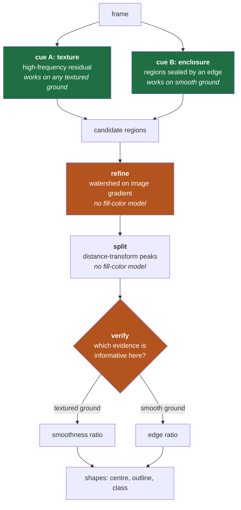

# Background-Agnostic Shape Detection

Making detection work on **any** background — any color, any texture, smooth or rough — and
on shapes that are gradient-filled rather than flat.

**New code:** [`detect_shapes_agnostic.py`](detect_shapes_agnostic.py) ·
[`detect_video_agnostic.py`](detect_video_agnostic.py) ·
[`test_backgrounds.py`](test_backgrounds.py)
**Previous version, kept unchanged for comparison:** [`detect_shapes.py`](detect_shapes.py) ·
[`detect_video.py`](detect_video.py)
**Tested on:** the static image, both dynamic videos, and 9 synthetic backgrounds × 2 fill types

---

## 1. Why the previous version could not be patched

The original algorithm ([`ALGORITHM.md`](ALGORITHM.md)) rests on two assumptions. Both are
true of grass with flat-filled shapes, and both are false in `PennAir 2024 App Dynamic Hard.mp4`:

| Assumption | Reality in the hard video |
|---|---|
| The background is **textured**, the shapes are **flat** | Shapes are **gradient-filled** — purple→green, navy→yellow, red→orange |
| Each shape is a **single uniform color** | A gradient's mean names a color the shape does not contain |

Run unchanged, it finds 4 of 5 shapes and misnames them:

```
old: ['circle', 'trapezoid', 'rectangle', 'hexagon']          <- 4 found, pentagon+triangle lost
new: ['pentagon', 'circle', 'rectangle', 'trapezoid', 'triangle']
```

Both failures trace to the same root. **A steep gradient looks exactly like texture** to a
local-variance measure: a smooth ramp has a large standard deviation while containing no detail
at all. So Stage 1 discards the gradient parts of shapes, and Stage 2's color model —
"sample the fill, threshold on distance from it" — has no single fill to sample.

> **TL;DR** — Gradient fills break both original assumptions at once, and for one shared
> reason: local variance cannot tell a smooth ramp from fine texture, and a gradient has no
> mean color worth sampling. That is a change of premise, not a parameter, so this is a new
> file and the old one is left intact as the record of what came before.

---

## 2. What actually generalises

The redesign models neither the background nor the fill. Every threshold is relative to the
frame's own statistics, and every measurement is a *ratio*, so nothing carries an absolute
expectation about what the scene looks like.



The organising idea is **pairs of cues that fail in opposite circumstances**. Texture and
enclosure; smoothness and edge contrast. Wherever one is blind the other is decisive, and the
detector chooses between them from the evidence in front of it rather than from a setting.

> **TL;DR** — Nothing in the pipeline describes a background or a fill. Detection, refinement
> and verification each come in a complementary pair, so a scene that defeats one member is
> handled by the other, and the choice between them is made per-candidate from measurements.

---

## 3. Fix 1 — Texture measured as high-frequency residual

The question the original asked was *"is this flat?"*. The question that generalises is
**"is this free of fine detail?"** — true of a flat fill and a gradient fill alike, false of
grass and asphalt alike.

Subtracting a blurred copy separates them. A gradient survives a blur almost unchanged, so it
cancels in the difference; texture does not survive it, so texture is what remains. Taking the
local deviation *of that residual* answers the right question:

```python
low = cv2.blur(cv2.blur(img, (r, r)), (r, r))
residual = img - low
energy_in = cv2.sqrt((residual * residual).sum(axis=2))
```

Measured on the hard video's frame 0:

| | Background (asphalt) | Worst shape interior | Separation |
|---|---|---|---|
| Original local variance | 18.07 | 8.47 | 2.13× — marginal |
| **High-frequency residual** | 11.01 | **2.45** | **4.50×** |

Two details that matter. The low-pass is **two box blurs** rather than a Gaussian — repeated
box blur converges on a Gaussian and each pass is O(1) per pixel regardless of radius. And the
color channels are **collapsed before** the variance rather than measured separately: one pass
over the residual's color magnitude answers the same question as three passes, and a boundary
between two equally *bright* colors still registers because the chroma carries it.

> **TL;DR** — Replacing "local variance" with "local variance of the high-pass residual" makes
> figure/ground independent of how the shapes are filled, widening the separation on asphalt
> from 2.1× to 4.5×. The threshold stays relative to the frame's median, which is what keeps it
> independent of the background's brightness and roughness.

---

## 4. Fix 2 — A second route for backgrounds with no texture

A smooth background — asphalt, still water, a painted wall, sky — has no texture to contrast
against. Cue A correctly *abstains*: it marks the whole frame quiet, and a region covering more
than 40% of the frame is rejected as a description of the background rather than of a shape.

Cue B covers that case by looking for regions **sealed off by an edge**:

```python
edges = (mag > max(np.percentile(mag, 92), 8.0))
interior = cv2.bitwise_not(edges)
found += _components(interior, lo, hi)
```

Two subtleties, both of which cost real debugging time:

**Read the enclosure, not the enclosure's outline.** Filling the outer contour of the edge map
seemed natural and was catastrophic: on a textured frame the edges form one connected web, so
its outer contour is the whole frame and the "region" swallowed 1.8 M of 2.07 M pixels. Taking
the *complement* of the edges instead makes each enclosed region its own component, and the
open background stays one large component that the size cap rejects.

**Labelled components, not `RETR_EXTERNAL` contours.** On a smooth background the non-edge area
is one sheet with the shapes punched out of it — the shapes are geometrically *inside* that
sheet's outer contour, so `RETR_EXTERNAL` never returns them. This silently dropped **every
shape on every smooth background** (0/5 across four of them). Connected-component labelling
does not care about nesting:

```python
n, labels, stats, _ = cv2.connectedComponentsWithStats(mask, 8)
```

That single change took synthetic recall from 44% to 78%.

> **TL;DR** — Cue A abstains on smooth ground, so cue B finds regions enclosed by an edge
> instead. Getting it right required reading enclosure as the *complement* of the edge map (its
> outer contour is the whole frame on textured ground) and extracting regions by
> connected-component labelling rather than `RETR_EXTERNAL`, which cannot see a region nested
> inside another and was dropping every shape on every smooth background.

---

## 5. Fix 3 — Refinement by watershed instead of color

The original sharpened outlines by sampling the fill color and re-thresholding on color
distance. A purple-to-green rectangle defeats that: thresholding around its mean keeps only the
middle band.

**Watershed asks nothing about color.** It floods outward from what is known to be inside and
inward from what is known to be outside; the two meet on the strongest ridge between them — the
real edge, whatever colors lie either side of it.

The one real parameter is how much clearance to leave before "certainly background", and it
cannot be fixed in advance:

- **too little** — a triangle's sharp corner pokes outside the cleared band, is labelled certain
  background, and gets flooded away. The triangle came back a **hexagon, 13% too small**;
- **too much** — a *weak* edge loses the competition to some stronger ridge further out. The
  olive trapezoid on green grass leaked into the lawn and **overshot its area by 37%**.

Convexity settles it. Every target shape is convex, so a correct outline is solid and a leak is
visibly concave:

| Clearance | Leaking trapezoid | Every correct shape |
|---|---|---|
| 1 × window | 0.89 solidity | ≥ 0.96 |
| 2 × window | 0.78 | ≥ 0.96 |
| 3 × window | 0.72 | ≥ 0.96 |

So the algorithm takes the **widest clearance that still yields a convex result**, narrowing
only when it does not. In the common case the first attempt is accepted and this costs one
flood. Calibrated against the previous version's validated outputs, the refined areas land
within **0.3% mean error** on the static image.

> **TL;DR** — Watershed replaces color thresholding for refinement, so the fill can be
> anything. Its clearance parameter is genuinely two-sided — too small clips corners, too large
> leaks across weak edges — and is resolved by exploiting convexity: try widest first, accept
> the first result that is solid. Areas match the previously validated pipeline to 0.3%.

---

## 6. Fix 4 — Splitting overlaps by distance, not color

The original split merged blobs by clustering their fill colors. Two gradient shapes defeat
that completely — a single purple-to-green rectangle contains *more* color variation than the
gap between two different shapes.

Distance geometry replaces color. The distance transform gives every pixel its distance to the
nearest edge, so a convex shape has exactly **one** broad maximum at its middle and two
overlapping shapes produce a waisted region with **two** separated maxima. Seeding a watershed
from those maxima cuts the union where the shapes actually meet.

Counting maxima is itself the test for whether to split — a lone shape offers only one, so
nothing happens — and a solidity check short-circuits it, since two convex shapes can only
merge into a concave union.

> **TL;DR** — Overlapping shapes are separated by distance-transform maxima rather than color
> clusters, which a gradient fill would scramble. The number of maxima doubles as the decision
> of whether a split is warranted, and a solid region is skipped without examination.

---

## 7. Fix 5 — Verifying with whichever evidence is informative

Both detection routes can hallucinate: a patch of unusually even background passes cue A, and a
chance loop of texture passes cue B. Two scores are available, and the important discovery is
that **they are not interchangeable**.

| Verifier | Real shapes | Spurious asphalt blob | Verdict |
|---|---|---|---|
| Boundary contrast (edge) | 1.20 – 7.99 | 1.07 – 2.68 | **ranges overlap** |
| Texture contrast (smoothness) | 3.3 – 496 | 0.9 – 1.08 | clean 3× gap |

Accepting on *either* score imports the weaker test's false positives. Measured over both
videos, that let ragged patches of asphalt speckle through and inflated the track count to 195
for 5 shapes. Requiring smoothness alone admitted every real shape and **zero** false
positives — but would be blind on a smooth background, where nothing is rough and the ratio is
meaningless for every candidate alike.

So the detector measures how rough the ground around each candidate actually is, and demands
the evidence that means something there:

```python
if ring_energy >= texture_floor:
    if tex < min_tex_contrast:      # textured ground: smoothness is decisive
        continue
elif contrast < min_contrast:       # smooth ground: only the edge can tell
    continue
```

One further filter handles **patterned** backgrounds. A checkerboard's cells are individually
indistinguishable from shapes — uniform inside, bounded by a strong edge — so every per-region
test passes and 64 of them were reported. What gives them away is that there are so many, all
alike: a scene's real shapes differ in size and kind, while a tiling repeats one cell dozens of
times. A large group of candidates sharing a class and a size is therefore read as background
pattern. The rule is deliberately conservative — it costs a scene that genuinely holds eight or
more identical shapes, and buys immunity to a tiled floor.

> **TL;DR** — The two verifiers are not alternatives to be OR'd: on textured ground smoothness
> is decisive and the edge test leaks, on smooth ground only the edge test says anything. The
> detector picks per candidate by measuring the local roughness. A separate rule rejects
> repeating pattern cells, which are legitimately shape-like and were producing 64 false
> positives on a checkerboard.

---

## 8. Fix 6 — Identity by histogram, not mean color

The tracker previously carried identity by each shape's mean fill color. A gradient destroys
that: the mean names a color the shape does not contain, and it drifts as parts of the shape
are occluded or leave the frame.

A **hue/saturation histogram** records *which* colors are present instead of averaging them, so
a two-tone shape is described by its two tones and a partly hidden one still matches — the bars
shrink, but the occupied bins do not move. Value is dropped so a shadow does not rename a shape.

| Bhattacharyya distance | Value |
|---|---|
| Same shape, consecutive frames | **≤ 0.008** |
| Two different shapes | **≥ 0.893** |

A wider margin than mean color ever gave, and unaffected by the gradients that broke it.

> **TL;DR** — Track identity moves from mean fill color to a hue/saturation histogram, which a
> gradient cannot scramble and partial occlusion cannot shift. Consecutive-frame distance for
> the same shape is ≤ 0.008 against ≥ 0.893 for different shapes.

---

## 9. Results

### Synthetic suite — the direct test of background-agnosticism

`test_backgrounds.py` renders the same five shapes over nine backgrounds × two fill types.
Ground truth is exact because the scene is generated, and the centres are taken from each
shape's own rendered mask — not the drawing anchor, which for a triangle is 25 px from the true
centroid and would score a correct detection wrong.

| Background | Flat fill | Gradient fill |
|---|---|---|
| solid mid-grey · solid blue · solid white | 5/5 | 5/5 |
| smooth gradient | 5/5 | 5/5 |
| fine noise (sand) · coarse noise (gravel) | 5/5 | 5/5 |
| striped (wood) | 5/5 | 5/5 |
| green texture (grass) | 4/5 | 4/5 |
| checkerboard | 5/5 | 5/5 (3 pattern cells leak) |

**Recall 97.8% (88/90) · 0 misclassifications · mean centre error 0.3 px**

Smooth, textured, light, dark, patterned, flat-filled and gradient-filled — all handled by one
unchanged parameter set.

### Real footage

| | Static image | Grass video | **Hard video** |
|---|---|---|---|
| Shapes found | **5/5, all correct** | recall 93.0% | recall **93.3%** |
| Classification | 5/5 | 86.6% | **89.3%** |
| Centre error (median) | ≤ 1.4 px vs. validated | 2.0 px | **2.2 px** |
| Area error vs. validated | **0.3%** | 1.8% | 0.7% |
| False positives (per-frame count) | 0 | **0** | **0** |
| Tracks for 5 shapes | — | 34 | 40 |

The static image reproduces the previously validated results — areas within 0.3%, centres
within 1.4 px — **with no color model at all**.

> **TL;DR** — 97.8% recall and zero misclassifications across nine synthetic backgrounds and
> both fill types; 93% recall with ~2 px centre accuracy and zero false positives on both real
> videos; and the static image still matches the validated original to within 0.3% of area.

---

## 10. What it costs

Dropping the assumptions is not free, and the honest comparison is worth stating plainly:

| | Specialised ([`detect_shapes.py`](detect_shapes.py)) | Agnostic (this) |
|---|---|---|
| Grass video — recall | **98.0%** | 93.0% |
| Grass video — classification | **98.8%** | 86.6% |
| Hard video | **4/5, misnamed** | **93.3%, correct** |
| Smooth backgrounds | fails entirely | 5/5 |
| Gradient fills | fails | works |
| Throughput (1080p) | **42 fps** | 12 fps |

Two things are being traded for background independence:

**Speed.** 24 ms → 82 ms per frame. Watershed refinement, two detection routes and two
verifiers all cost real work. It runs at 22 fps at half resolution (`--scale 0.5`), and the
optimisations already applied were substantial — 655 ms → 82 ms, an 8× improvement from
replacing a 139-pixel dilation with a distance transform, cropping every per-shape measurement
out of full-frame masks, and sharing one distance transform between the two verifiers.

**Classification on low-contrast boundaries.** The dominant residual error, on both videos, is
the trapezoid — the shape whose boundary contrast is weakest. Its watershed outline develops
small outward bulges where the flood wanders at a weak edge, and each bulge reads as an extra
vertex, so it is intermittently called a pentagon. Contour smoothing, larger morphological
kernels, shifted `approxPolyDP` ranges and a best-fit-polygon classifier were all tried and
measured; none beat the current settings, so the honest report is that this is a real weakness
rather than a solved problem.

**Recommendation:** keep both. Where the ground is known to be textured and the shapes flat, the
specialised detector is more accurate and 3.5× faster. Where the background is unknown — which
is the actual condition of a drone in flight — the agnostic one is the only one that works.

> **TL;DR** — Background independence costs 3.5× in speed (42 → 12 fps, mitigable to 22 fps at
> half resolution) and about 12 points of classification accuracy on the low-contrast trapezoid,
> in exchange for working on asphalt, smooth grounds and gradient fills where the specialised
> version fails outright. Both are kept, because they are better at different jobs.

---

## 11. Usage

```bash
python3 detect_shapes_agnostic.py                     # static image
python3 detect_shapes_agnostic.py img.png --debug     # dump the texture map and mask

python3 detect_video_agnostic.py                      # defaults to the hard video
python3 detect_video_agnostic.py "PennAir 2024 App Dynamic.mp4" -o out.mp4
python3 detect_video_agnostic.py --scale 0.5          # ~22 fps
python3 detect_video_agnostic.py 0                    # live camera, same code path

python3 test_backgrounds.py --save sheet.png          # the agnosticism test suite
```

Outputs: [`output_hard.mp4`](output_hard.mp4) and `track_hard_agnostic.csv`.

> **TL;DR** — Same interface as the previous version, defaulting to the hard video; `--scale`
> trades resolution for throughput, a camera index streams live, and `test_backgrounds.py`
> reproduces the agnosticism table in §9.
