# PennAir 2024 Software Challenge — Shape Detection

Detecting shapes on a grassy background, marking their centres, tracking them through video,
making the whole thing work on **any** background, and finally reporting where each shape is in
**metres and inches** rather than pixels.

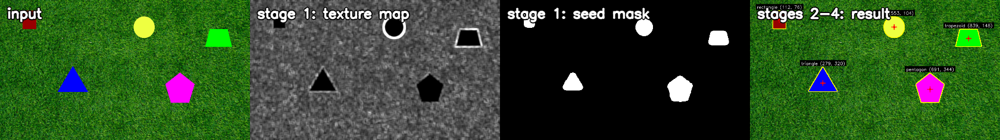

| Deliverable | Result |
|---|---|
| **Static image** — detect shapes, mark centres | 5/5 detected, classified and centred |
| **Video** — streamed frame by frame | recall **98.0%** · classification **98.8%** · 30 fps on a 30 fps source |
| **Background-agnostic** — any colour/texture | **97.8%** recall over 9 backgrounds × 2 fill types · 0 misclassifications |
| **3D** — metric X, Y, Z from the camera | depth to **0.3%** of truth · a position on **every** frame |

**See it running** — ▶ [video](output_dynamic_CLIP.mp4) · ▶ [any background](output_hard_CLIP.mp4) · ▶ [in 3D](output_hard_3d_CLIP.mp4)

---

## How to run

```bash
pip install opencv-python numpy
```

Four deliverables, four commands. Each writes an annotated result you can look at.

| # | Deliverable | Run it | Writes |
|---|---|---|---|
| 1 | **Picture** | `python3 detect_shapes.py` | `output_static.png` |
| 2 | **Video** | `python3 detect_video.py` | `output_dynamic.mp4`, `track_log.csv` |
| 3 | **Background-agnostic** | `python3 detect_video_agnostic.py` | `output_hard.mp4`, `track_log_hard.csv` |
| 4 | **Background-agnostic 3D** | `python3 detect_video_3d.py` | `output_hard_3d.mp4`, `track_log_3d.csv` |
| 4′ | …on a single photo | `python3 detect_3d.py` | `output_static_3d.png` |
| 5 | **ROS 2** | `ros2 launch pennair_vision shapes.launch.py` | live topics — see [Part 5](#part-5--ros-2) |

Every script takes its input as the first argument, so each runs on your own
footage — and `0` means the webcam:

```bash
python3 detect_video_3d.py 0                       # live camera, in 3D
python3 detect_3d.py my_photo.png --units m        # one image, metres
python3 detect_video_agnostic.py clip.mp4 --scale 0.5 --no-video
python3 detect_shapes_agnostic.py --debug          # dump the intermediate maps
```

Useful flags: `--max-frames N` to stop early, `--no-video` to measure without
encoding, `--scale` to downsample, and for the 3D scripts `--units in|ft|m` and
`--pp given|center` (see [the principal point](#a-note-on-the-principal-point)).

### Testing each step

```bash
python3 run_tests.py            # all four steps, ~50 s
python3 run_tests.py --step 4   # just the 3D one; --step is repeatable
python3 run_tests.py --full     # whole videos, not the first 150 frames
```

The exit code is the number of failed steps. What each one checks:

| Step | Checks | Ground truth from |
|---|---|---|
| 1 picture | five shapes found, all five named, centres inside the image | the supplied still |
| 2 video | ≥4.5 shapes tracked per frame, bounded per-frame cost, identities stable | the grass footage |
| 3 background-agnostic | ≥95% recall and 0 misclassifications over 9 synthetic backgrounds × 2 fills, then the asphalt footage | scenes generated here, so truth is exact |
| 4 3D | depth and lateral position against known metric truth, the scale bootstrap, resolution invariance, the projection algebra, the operating envelope, and that a real altitude change is still followed | scenes projected *from* metric truth through K |

Steps 3 and 4 can also be run on their own: `python3 test_backgrounds.py` and
`python3 test_pose3d.py`. Throughput is reported rather than graded, because it
is as much a property of the machine as of the code.

---

## In 60 seconds

The shapes cannot be found by **colour** — one of them is the same green as the grass. They can
be found by **texture**: grass is thousands of tiny blades, the shapes are smooth. That one
observation drives everything:

1. **Find** shapes as regions of unusually low local texture.
2. **Sharpen** their outlines against the original pixels, because step 1 is blurry at the edges.
3. **Measure** centres from image moments, classify from polygon geometry.
4. For video, add **memory** — track each shape across frames so a moment of occlusion cannot
   lose it or rename it.
5. For arbitrary backgrounds, replace every assumption about what the background and the shapes
   *look like* with measurements that are **relative to the frame itself**.
6. For 3D, turn each centre into **metric coordinates** — the intrinsics give the ray, and the
   circle's known radius gives the distance along it.

---

## What's in this repo

| File | What it is |
|---|---|
| [`detect_shapes.py`](detect_shapes.py) | Static-image detector. Also the per-frame detector for video |
| [`detect_video.py`](detect_video.py) | Streaming pipeline + tracker |
| [`detect_shapes_agnostic.py`](detect_shapes_agnostic.py) | Background-agnostic redesign |
| [`detect_video_agnostic.py`](detect_video_agnostic.py) | Streaming version of the above |
| [`pose3d.py`](pose3d.py) | The camera model: pixel centres → metric X, Y, Z |
| [`detect_3d.py`](detect_3d.py) | Static image, in three dimensions |
| [`detect_video_3d.py`](detect_video_3d.py) | Streaming, in three dimensions |
| [`test_backgrounds.py`](test_backgrounds.py) | Renders shapes on 9 synthetic backgrounds and scores the result |
| [`test_pose3d.py`](test_pose3d.py) | Builds scenes from known metric truth and asks the pipeline to recover it |
| [`run_tests.py`](run_tests.py) | Runs all four steps end to end |
| [`ros2_ws/src/pennair_msgs/`](ros2_ws/src/pennair_msgs) | ROS 2 interfaces: `ShapeDetection`, `ShapeDetectionArray` |
| [`ros2_ws/src/pennair_vision/`](ros2_ws/src/pennair_vision) | ROS 2 nodes, launch file and RViz config |
| [`ROS2_SETUP.md`](ROS2_SETUP.md) | Building the ROS 2 environment from scratch, step by step |
| [`make_figures.py`](make_figures.py) | Regenerates every figure in this README |

**Reports** — short: [`STATIC_IMAGE_REPORT.md`](STATIC_IMAGE_REPORT.md) ·
[`VIDEO_REPORT.md`](VIDEO_REPORT.md) · [`BACKGROUND_AGNOSTIC.md`](BACKGROUND_AGNOSTIC.md)
**Deep dives** — [`ALGORITHM.md`](ALGORITHM.md) · [`VIDEO_DETECTION.md`](VIDEO_DETECTION.md)
**Talking it through out loud** — [`VIDEO_DETECTION_SIMPLE.md`](VIDEO_DETECTION_SIMPLE.md)

The original detector is kept unchanged alongside the agnostic one. They are better at
different jobs — see [trade-offs](#trade-offs-which-one-to-use).

---

## The one idea everything rests on

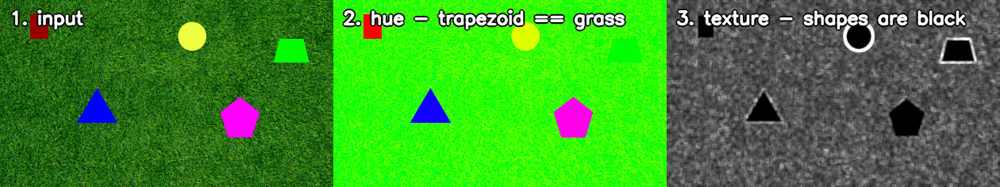

The instinctive approach is to threshold out the green background in HSV. It fails here, and
the middle panel shows why: **the trapezoid is the same hue as the grass.** Any threshold wide
enough to erase the lawn erases the trapezoid too.

The right panel is the same scene measured by *local texture* instead. Every shape is a black
hole in a field of noise — including the green one. Texture separates all five at once,
regardless of colour.

| | Grass | Green trapezoid |
|---|---|---|
| Hue | ~60° | ~60° — **identical** |
| Local intensity variation | 13.0 | **0.0** |

> **Interview note.** The whole design follows from choosing a discriminator that doesn't
> collide with the thing you're looking for. Colour collides here; texture does not.

---

## Part 1 — Static image


**Stage 1 — find them by smoothness.** For every pixel, compute the standard deviation of its
neighbourhood. Rather than loop over pixels, use `Var(X) = E[X²] − E[X]²` where both terms are
box filters — two convolutions, milliseconds instead of seconds. Threshold, then clean up with
morphology.

**Stage 2 — sharpen the outline.** Stage 1's boundary is wrong in two ways: the measuring
window straddles each edge (so the region is inset ~5 px) and the morphology rounds off
corners. Fix: use the blurry region only to *sample the shape's fill colour*, then recover the
boundary by colour distance against the original pixels. Sharp corners come back.

**Stage 3 — centres.** Image moments: `cx = M10/M00`. This is the true area centroid, not the
bounding-box middle — which would be visibly wrong for the triangle, whose centroid sits ⅓ of
the way up from its base.

**Stage 4 — classify.** Circularity `4πA/P²` identifies the circle; a sweep of `approxPolyDP`
tolerances votes on vertex count for polygons; comparing opposite side lengths separates
rectangle from trapezoid.

| Shape | Centre | Area | Check |
|---|---|---|---|
| pentagon | (691, 344) | 8791 px | ~110 px across ✓ |
| trapezoid | (839, 148) | 5641 px | ~90 × 65 ✓ |
| triangle | (279, 320) | 5595 px | base 110, height 102 ✓ |
| circle | (553, 104) | 5122 px | r = 40.4 → 81 px diameter ✓ |
| rectangle | (112, 76) | 3564 px | 51 × 70 ✓ |

### What went wrong here

| Problem | Cause | Fix |
|---|---|---|
| **Otsu returned zero shapes** | Otsu needs two comparably-sized classes. The shapes are ~5% of the frame, so it split the *grass* distribution in half and called the lawn flat | Threshold relative to the background's own roughness: `0.35 × median(σ)`. Self-calibrating, so it also survives different lighting |
| **Triangle classified as "trapezoid"** | Morphology rounded its corners, so `approxPolyDP` invented vertices | The colour-refinement stage (Stage 2) exists because of this |
| **Circle test had a 0.05 margin** | A regular pentagon's ideal circularity is 0.865 — *above* the 0.85 threshold. It only worked because rasterised contours measure slightly rounder-than-ideal | Added a second, independent signal: a circle's vertex count never settles (11/18 agreement) while a polygon's is unanimous (18/18) |
| **Areas ~20% too small** | Measured on the pre-refinement region | Measure the refined contour. Caught by sanity-checking areas against visible pixel dimensions |

---

## Part 2 — Video

The brief was to treat the video as a **live drone feed**, which rules out three tempting
things: seeking to arbitrary frames, a second pass, and looking at future frames. So there is
exactly one place a frame enters, and no `cap.set()` anywhere in the pipeline:

```python
while True:
    ok, frame = cap.read()      # one frame at a time; nothing else is available
```

The proof it was respected: `python3 detect_video.py 0` runs a live webcam through the identical
code path.

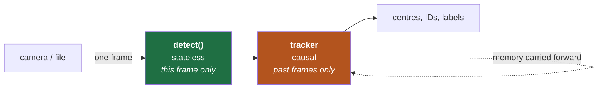

Detection stays a **pure function of one frame** — the same function the static script calls —
so a bad frame can't corrupt later ones and any failure reproduces from a single image. All
state lives in the tracker, which keeps the only place a causality bug could hide small.

### The problem a single frame cannot solve

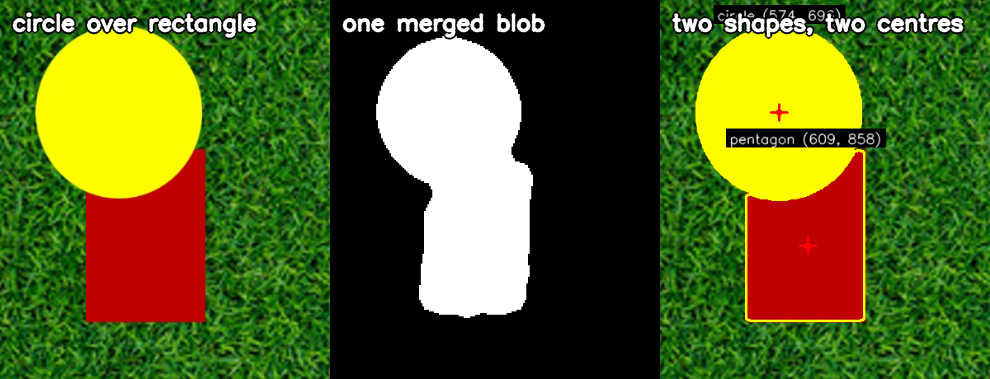

When shapes overlap, both are smooth, so the texture stage sees **one** region — that keyhole.
No amount of tuning fixes it, because as far as texture is concerned they really are one
region. But they are different *colours*, and Stage 2 already samples fill colour. Dropping the
assumption of one colour per blob splits them (k-means, guarded so a single shape is never
split).

That recovers two centres. It does **not** recover the rectangle's identity — with a bite taken
out of it, its visible outline genuinely is a five-sided polygon, and no per-frame method can
know otherwise.

### What memory buys

[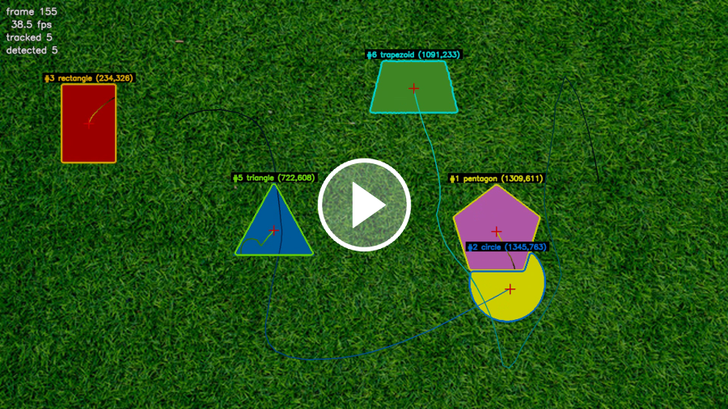](output_dynamic_CLIP.mp4)

*▶ [`output_dynamic_CLIP.mp4`](output_dynamic_CLIP.mp4) — 10 s. Persistent IDs, motion trails, and shapes recovering their names after an occlusion.*

The tracker gives each shape a persistent ID, a smoothed centre, a motion trail, and a **voted
label** — the majority over ~1.5 s, counting only frames where the whole shape is visible.
That last guard is the important part: letting a clipped outline vote would let noise rename
the shape.

| Classification accuracy | |
|---|---|
| Per-frame, no temporal help | 86.6% |
| **After temporal voting** | **98.8%** |

An 11× reduction in error rate, from information that was already present and simply unused.
A shape being *predicted* rather than measured is drawn dashed and labelled `[predicted]`, so
the overlay never presents an inference as an observation.

### What went wrong here

| Problem | Cause | Fix |
|---|---|---|
| **Found 3 of 5 shapes** | Overlapping shapes merged into one blob | Split merged blobs by fill colour |
| **47 tracks for 5 shapes** | Matching on position alone. An occluded shape's centroid *lurches*, and a lurch past the gate makes the tracker drop it and re-acquire it as a new ID | Match on position **and** colour. Colour is untouched by occlusion, so it holds identity exactly when position becomes unreliable → 29 tracks |
| **Ragged trapezoid → "hexagon"** | Its olive fill sits only 80 units from grass in colour space (others: 180–260), so grass pixels leak through and fray the outline | The leak is *speckle*; the shape is *solid*. A morphological opening removes one and keeps the other. A tighter colour threshold was tried and measured — it did not help |
| **Ran at 7 fps** | Profiling showed both hotspots were somewhere other than expected | See below |
| **Phantom tracks drifting off-screen** | Coasting tracks predicted out to x = 2322 on a 1920-wide frame | Retire a track once its predicted position leaves the frame |

### Making it real-time

The first working version ran at **137 ms/frame (7.3 fps)**. Rather than guess, profile:

| | Before | After | |
|---|---|---|---|
| Stage 1 | 76.9 ms | 12.6 ms | Cost was the *morphology*, not the variance — box filters are O(1) per pixel. Stage 1 only has to *locate*, so it runs downscaled |
| Stage 2 | 64.1 ms | 13.1 ms | A 101×101 dilation cost more than everything else combined; replaced with a cheap overlap test |
| **Full frame** | **137.1 ms** | **24.1 ms** | **5.7× — with bit-identical detections** |

Nothing was traded for speed; work that wasn't buying anything was removed. End to end,
including tracking and drawing: mean 23.8 ms, **p95 29.6 ms, max 39.4 ms** — for a live feed
the tail matters more than the mean, and the worst frame of 1837 still cleared the 33 ms
deadline.

---

## Part 3 — Background-agnostic

`PennAir 2024 App Dynamic Hard.mp4` changes the ground to dark asphalt **and** makes the shapes
gradient-filled. Run unchanged, the original finds 4 of 5 and misnames them:

```
old: ['circle', 'trapezoid', 'rectangle', 'hexagon']              <- pentagon + triangle lost
new: ['pentagon', 'circle', 'rectangle', 'trapezoid', 'triangle']
```

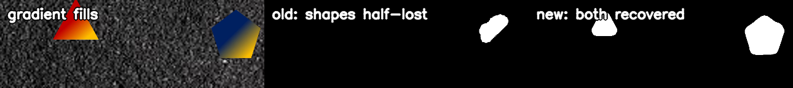

Both failures have one root cause: **a smooth gradient looks exactly like texture to a variance
measure.** A ramp has a large standard deviation while containing no detail at all. The middle
panel shows the consequence — the triangle vanishes and the pentagon is half-eaten.

The fix is to change the question from *"is this flat?"* to **"is this free of fine detail?"** —
true of a flat fill and a gradient alike. Subtract a blurred copy first: a gradient survives a
blur and cancels out, texture does not.

| | Background (asphalt) | Worst shape interior | Separation |
|---|---|---|---|
| Original variance | 18.07 | 8.47 | 2.13× — marginal |
| **High-pass residual** | 11.01 | **2.45** | **4.50×** |

### Every assumption, replaced

| Original assumed | Agnostic version uses | Why |
|---|---|---|
| Background is textured | Texture cue **+** an enclosure cue | A smooth background (water, asphalt, sky) has no texture to contrast against |
| Shapes are flat | High-frequency residual | Works for flat *and* gradient fills |
| One fill colour per shape | **Watershed** on the image gradient | Needs no colour model at all |
| Colour clustering to split overlaps | **Distance-transform maxima** | A gradient has more internal colour spread than the gap between two shapes |
| Mean colour for track identity | **Colour histogram** | Records *which* colours are present instead of averaging them away |

The organising principle is **pairs of cues that fail in opposite circumstances**, with the
detector choosing between them from measurements rather than from a setting.

### How the watershed refinement works

Replacing the colour model was the biggest of those changes, so it's worth seeing.

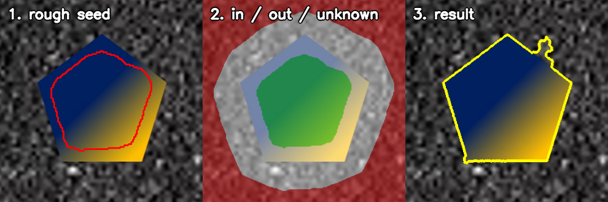

Picture the image as a landscape where edges are ridges and flat areas are valleys. Let water
rise from two marked places at once, and where the two floods meet, a dam forms — always along
a ridge, which is to say **along the strongest edge**.

We supply the markers: **green** is "certainly inside the shape" (the rough seed, eroded a
little for safety), **red** is "certainly background", and **white** is "you decide". The flood
settles the white band, and the dam that forms there is the outline.

The point is that watershed **never asks what colour anything is** — only where the strongest
edge between the two markers lies. That pentagon runs navy to yellow, so its average colour is
a murky green that appears nowhere in it and the old colour test is helpless; watershed doesn't
care. Note how little the seed contributed: 24,003 of the shape's 37,400 pixels, rounded and
missing every corner. It's a hint about where to start flooding, not an answer.

**But how does a rounded green blob become a sharp-cornered pentagon?** Because the marker's
outline never reaches the answer. What shapes the result is the *terrain* the water runs over:

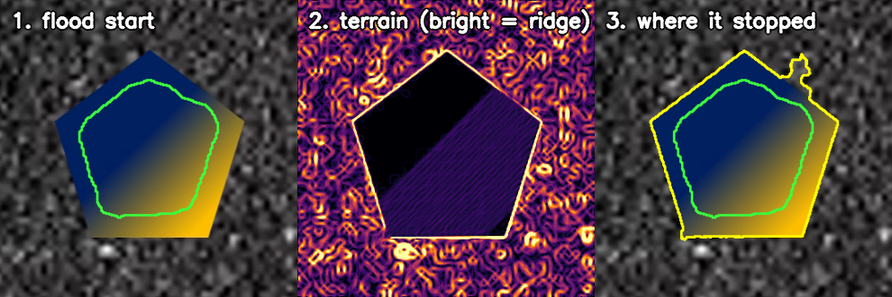

Panel 2 is the gradient map — bright means a ridge that is hard to cross, dark means easy
going. The pentagon's edge is a razor-sharp bright outline with clean corners, and *that* is
the mould. The rounded green blob is just the puddle you start pouring from.

Watershed floods easy terrain first and leaves the hardest for last. The pentagon's inside is
almost black in panel 2 — near-zero gradient — so water races through it and runs right up into
every corner. The edge is the brightest thing in frame, so it is decided last, and the corner
belongs to the *inside* flood because reaching it from outside would mean climbing the ridge
first. Concretely: the green marker is 21,114 px and the answer is 37,400 px, so **44% of the
final shape is territory the flood claimed** — corners included.

The one genuinely tricky parameter is how far out to put the red zone, and it bites in both
directions — too close and a sharp corner falls outside it, is labelled background and gets
erased (the triangle came back a hexagon, 13% too small); too far and a *weak* edge loses to
some stronger ridge further out (the olive trapezoid overshot by 37%). Convexity settles it:
all these shapes are convex, so the algorithm tries the widest clearance first and accepts the
first result that is still convex.

That failure is the same mechanism seen from the other side: the flood can only decide pixels
that are *undecided*. A corner pre-labelled "certainly background" was never up for decision,
so no amount of flooding could rescue it. Widening the clearance put those corners back into
the white band, and once they were merely undecided the interior flood reached them trivially.

For the honest caveat, look at the top-right of the answer above — a small bulge where the
flood wandered. The same spot in the terrain map shows why: the ridge is weaker there and the
asphalt speckle is dense, so the water found a gap and got caught on a nearby speckle ridge
instead of the real edge. Centre and area stay accurate; it's the vertex count that suffers,
which is why the trapezoid is the shape most often misnamed.

[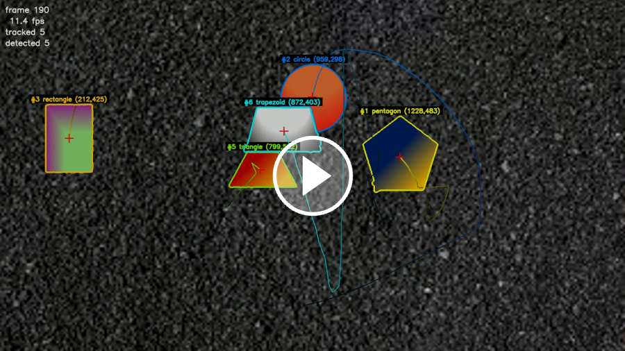](output_hard_CLIP.mp4)

*▶ [`output_hard_CLIP.mp4`](output_hard_CLIP.mp4) — 10 s, the same segment as the 3D clip below, so the two can be compared directly.*

### Proving it, on backgrounds nobody supplied

Real footage only covers two backgrounds. [`test_backgrounds.py`](test_backgrounds.py) renders
the same shapes over nine synthetic ones — smooth, textured, light, dark, patterned — with both
flat and gradient fills. Ground truth is exact because the scene is generated.

**Recall 97.8% (88/90) · 0 misclassifications · mean centre error 0.3 px**, on one unchanged
parameter set covering solid colours, smooth gradients, sand, gravel, grass, wood grain and a
checkerboard. The 13 false positives are all checkerboard cells, discussed below.

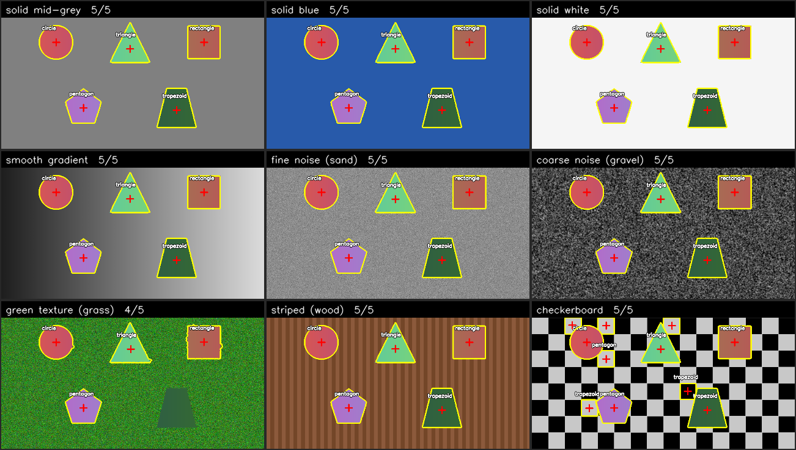

Every tile above uses **gradient** fills — the harder case, so passing here implies the flat one.
Nothing is tuned per background: the same parameters produce all nine.

Two failures are visible rather than hidden. On **green texture (grass)**, bottom-left, the dark
green trapezoid on green grass is never outlined — the same weak-contrast problem the real
footage has, reproduced synthetically. On **checkerboard**, bottom-right, three small yellow
boxes are pattern cells that survived the repeat filter; they are genuinely shape-like, being
uniform inside and bounded by a strong edge.

Reproduce it with:

```bash
python3 test_backgrounds.py --save sheet.png
```

### What went wrong here

| Problem | Cause | Fix |
|---|---|---|
| **0/5 on every smooth background** | `RETR_EXTERNAL` returns only outermost contours. On smooth ground the shapes are regions *nested inside* the background region, so it never returned them | Connected-component labelling, which doesn't care about nesting. Synthetic recall 44% → 78% |
| **A region swallowed 1.8M of 2.07M pixels** | Filling the edge map's outer contour — on textured ground the edges form one connected web spanning the frame | Read enclosure as the *complement* of the edge map |
| **Triangle → hexagon, 13% too small** | Watershed clearance too small: sharp corners poked outside the cleared band and were labelled certain background | Clearance is genuinely two-sided (too large leaks across weak edges, overshooting by 37%). Resolved using convexity: try widest first, accept the first result that is still convex |
| **195 tracks for 5 shapes** | Accepting a candidate on *either* verifier imported the weaker one's false positives | The two verifiers aren't interchangeable — on textured ground smoothness is decisive, on smooth ground only the edge test says anything. Pick per candidate by measuring local roughness → **zero** false positives |
| **64 false positives on a checkerboard** | Its cells are genuinely shape-like: uniform inside, bounded by a strong edge | What gives them away is that there are dozens, all alike. A large group sharing a class and size is read as background pattern → 13, all of them cells clipped by the frame edge, which vary in size and so never form a group |

---

---

## Part 4 — Three dimensions

Everything so far answers *where in the image*. A drone needs *where in the world*. The brief
supplies exactly enough to close that gap:

```
K = [[2564.3186869,      0,       0],          the circle has radius 10 in
     [     0,      2569.70273111, 0],          the surface is flat
     [     0,           0,        1]]
```

[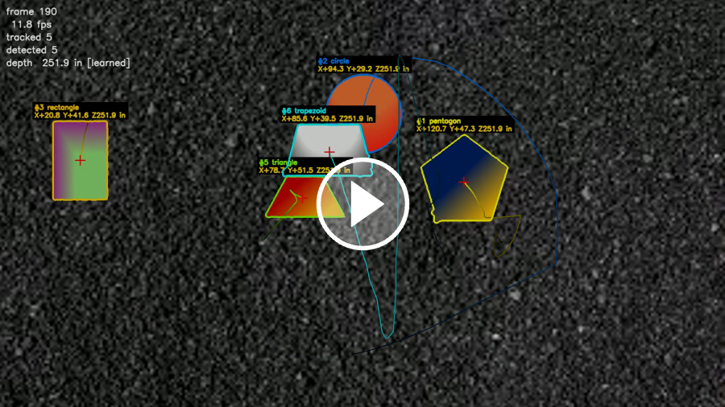](output_hard_3d_CLIP.mp4)

*▶ [`output_hard_3d_CLIP.mp4`](output_hard_3d_CLIP.mp4) — the same 10 s as Part 3's clip, now carrying X, Y and Z. Watch the depth source in the corner switch between `[circle]` and `[learned]` as the ruler leaves and re-enters view; the number barely moves.*

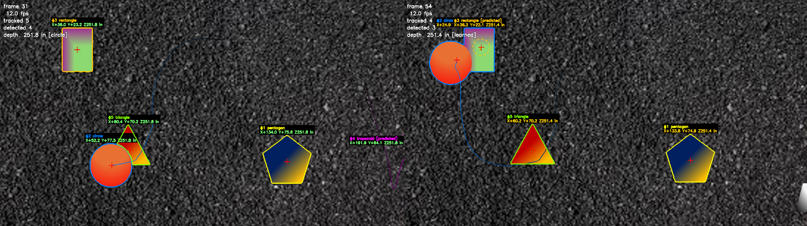

Intrinsics turn a pixel into a **ray**; the known radius fixes **how far along it** the shape
sits. Two lines of algebra, and the pipeline's output stops being pixel coordinates:

```
Z = R · √(π · fx · fy / A_px)          depth, from the circle's pixel area
X = (u − cx) · Z / fx                  then the ray, scaled to that depth
Y = (v − cy) · Z / fy
```

| | Static image | Hard video (1841 frames) |
|---|---|---|
| Plane depth | **318.4 in** (26.5 ft) | **251.7 in** (21.0 ft) |
| Frames with a position | 1/1 | **1841/1841 — 100%** |
| Measured by the circle · by a learned ruler | 1 · 0 | 1150 · 660 |
| Steadiness, camera holding altitude | — | sd **0.34%**, median frame **0.02%** off |

### Three choices worth defending

**Depth from area, not from a radius.** A circle at distance projects to an ellipse of
semi-axes `fx·R/Z` and `fy·R/Z`, so its area is `π·fx·fy·R²/Z²`. Reading `Z` off that uses
every boundary pixel the contour has; reading it off a measured radius uses one or two of them.
It also generalises for free — rewritten for an arbitrary metric area `A_m`, the same relation
is `Z = √(fx·fy·A_m/A_px)`, which is what the bootstrap below runs on.

**Intrinsics scale with the image.** `fx ≈ 2564 px` is a measurement *in pixels*, and it
belongs to the 1920-wide footage. The supplied still is 960 wide. Using K unchanged on both
would report the still twice as far away as it is, and `--scale 0.5` would silently change the
answer. [`Camera.for_frame`](pose3d.py) scales K by the frame's own width, so one calibration
covers every resolution.

**The circle is corroborated, not trusted.** Depth initially rested on the classifier saying
"circle". But a mistake there does not *lose* the scale, it **falsifies** it: a regular pentagon
fills 0.757 of its circumcircle, so a pentagon that size read as the 10 in circle reports the
scene ~15% **further away** than it is, silently and with no symptom. So the label is checked against a measurement
that fails differently — contour area over the area of its smallest enclosing circle. On the
supplied footage the circle scores **0.947–0.957** and the runner-up **0.753**, a margin wide
enough that the threshold is not a tuned number. Circularity `4πA/P²` would have been the
obvious second test and is the wrong one here: it is built on perimeter, which a ragged
boundary inflates, so it is weakest exactly when segmentation is shaky. Area over area is
stable.

> Same habit as the circle test in Part 1 and the tracker's matching in Part 2: when one
> signal carries too much weight, add a second that fails differently.

### When the ruler leaves the frame

One object has a known size, and it is not visible in every frame — it drifts off-screen, and
in the hard footage it spends a stretch sitting on top of the rectangle.

The way out is that the ruler doesn't have to be *present*, only to have been present. While
the circle is in view its depth also reveals the true size of everything else on the plane —
one division per shape — and a shape whose metric size is known is a ruler from then on. So the
scale is bootstrapped once and afterwards carried by whichever shapes happen to be in frame,
keyed by the tracker's identities. The right-hand panel above is a frame measuring `[learned]`,
with the circle occluding the rectangle; it agrees with the `[circle]` frame beside it to
0.4 in in 21 ft.

Over 1841 frames of the hard footage the circle measured 1150 and learned rulers covered
660 — **a position on every frame**, and the overlay always says which.

Only a *whole, unobstructed* outline may serve as a ruler, for the same reason only a whole
outline may vote on classification in Part 2: area is the entire measurement, so a shape half
out of frame would read as twice its true distance. Coasting, clipped and occluded tracks are
all excluded.

### Which stand-in to believe

Stand-in rulers are where the depth went wrong. Taking the median of whatever is in view is the
obvious way to fuse them and it is not good enough: once the circle has gone there are usually
just **two** rulers, so the median is their average and one bad reading moves the answer by half
its error. The first full run had 1.3% of frames more than 5% out — all single frames, all
carried by a learned ruler.

Listing those frames alongside every estimate that produced them showed the same thing every
time: **a correct estimate was sitting right next to the wrong one.**

```
frame 335   rectangle -> 251.6 in  (size history steady to 0.2%)
            trapezoid -> 292.8 in  (size history wobbles by 19.3%)   <- averaged in
frame 682   pentagon  -> 251.8 in  (0.2%)
            pentagon  -> 222.5 in  (29.7%)                           <- averaged in
```

So don't average the disagreement away — **pick**, on two signals that fail differently:

- **How steady that ruler has been.** A ruler is only as good as the length marked on it. The
  interquartile spread of each shape's own size estimates is already in the memory: the good
  rulers sit at 0.2–0.7%, the bad ones at 13–30%. It is not a close call.
- **Continuity.** The plane does not teleport. Of the rulers that survive, believe the one
  nearest the last known depth, and rate-limit the result — at 30 fps, a 5% jump is a climb
  faster than 100 in/s.

| Fusion rule | sd | frames >5% out | worst frame |
|---|---|---|---|
| median of everything in view | 1.57% | 1.30% | **+44%** |
| + rate limit | 0.80% | 0.87% | +10.3% |
| **+ pick by steadiness and continuity** | **0.34%** | **0.05%** | **+5.0%** |

*All three over the same 1841 frames, against the median depth — the camera holds altitude
throughout, so any spread is error.*

Continuity could in principle lock in a drift, which is why it only ever chooses *between*
independent measurements and never invents one, and why the circle overrides it outright
whenever it is visible. And a rate limit that also flattened a genuine climb would be worse than
the problem it solves, so `test_pose3d.py` flies one: 80 in of altitude in 17 frames, tracked to
**0.37%**.

### Proving it, since nobody measured the drone

The footage cannot test this. No one recorded how far the camera was from the ground, so the
supplied videos can only show that the depth comes out *stable* — which a constant-valued bug
would also achieve.

So [`test_pose3d.py`](test_pose3d.py) builds the scene from the other end: shapes are defined
in inches on a plane at a chosen depth and projected **through K** to make the image, then the
pipeline is asked to recover what went in. Ground truth is exact because it is the input.

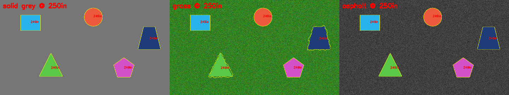

| Check | Result |
|---|---|
| Depth, over 12 scenes × 3 backgrounds × flat and gradient fills | mean error **0.71 in — 0.3%** |
| Lateral position X, Y | mean error **0.35 in** |
| Scale survives the circle leaving view | recovered from a learned ruler, same value |
| An 80 in climb over 17 frames | tracked to **0.37%** — the rate limit does not fight the drone |
| Same scene at 1920 and at 960 | agree to 1% — intrinsics really do scale |
| `project(backproject(u,v,Z)) == (u,v)` | exact to 0.0 px |

### The operating envelope

A drone changes altitude, so "how accurate" is only half the answer — the other half is **over
what range**. The algebra is exact at any distance; the detector is not. Sweeping depth until
it fails:

| Distance | Circle radius | Shapes found | Depth error |
|---|---|---|---|
| 150–400 in (12–33 ft) | 171 → 64 px | **15/15** | 0.13–0.34% |
| 500 in (42 ft) | 51 px | 6/15 | 0.65% |
| 600 in (50 ft) | 43 px | 0/15 | — |

Reliable out to about **33 ft at 1080p**, where the circle is ~64 px in radius. Past that it is
the *detector* that gives out, not the camera model, and for a specific reason: the window used
to judge whether an interior is smooth is a fixed size, so once a shape is small enough that
the window straddles its boundary, its interior stops measuring as smooth. Reported rather than
asserted away, because it is the number that says how high the drone may fly.

### What went wrong here

| Problem | Cause | Fix |
|---|---|---|
| **Nothing found past 400 in** | Interior smoothness was sampled 4 px inside the outline, while the window doing the measuring is ~21 px wide. Harmless on a shape 200 px across; decisive on one 60 px across, where that contaminated band is most of what gets measured and the interior reads as rough as the ground | Sample the innermost quarter instead, so the band scales with the shape. Range 250 → 400 in, and +2 triangle detections per 20 frames on the *real* footage. It costs 7 extra false positives on the checkerboard — measured, and reported above rather than netted out |
| **A pentagon could have been the ruler** | Depth rested entirely on one classifier label, and a mistake reports the scene 15% further away with no symptom | Corroborate with area ÷ enclosing-circle area (see above) |
| **Depth lost whenever the circle was occluded** | Only one object had a known size | While the circle is up it sizes everything else; those become rulers |
| **1.3% of frames off by up to 44%** | Stand-in rulers were fused by median. With two in view that is an average, so one bad area moved the answer by half its error | Pick rather than average — by how steady each ruler's own measured size has been, and by continuity with the previous frame. 44% → 5.0% worst case, sd 1.57% → 0.34% |
| **Still and video disagreed on distance** | K belongs to 1920-wide footage; the still is 960 wide | Scale K with the frame in `Camera.for_frame` |
| **One synthetic scene reports no depth at all** | Grass plus a gradient fill frays the circle's boundary badly enough that it scores 0.78 — below the gate | Left as a refusal. A single frame has no second ruler to fall back on, and no depth beats a wrong one. The video path does have a fallback, and takes it |

### A note on the principal point

The supplied K has `cx = cy = 0`, which places the optical axis at the **top-left pixel** rather
than the image centre. That is used exactly as given, so X and Y are measured from the top-left
corner's line of sight and come out large and single-signed — the circle in the hard footage
sits at X = +103 in, Y = +19 in. A calibrated camera would normally report `cx ≈ 960, cy ≈ 540`,
which recentres those on the frame; `--pp center` does that. **Z is identical either way**,
since depth depends only on `fx` and `fy` — which is worth knowing, because it means the choice
cannot quietly corrupt the altitude. `test_pose3d.py` asserts it.

---

## Part 5 — ROS 2

The pipeline so far is a program you run. A drone needs it to be a *node* — something that
receives frames from wherever they come from and publishes what it found, so the rest of the
stack can act on it.

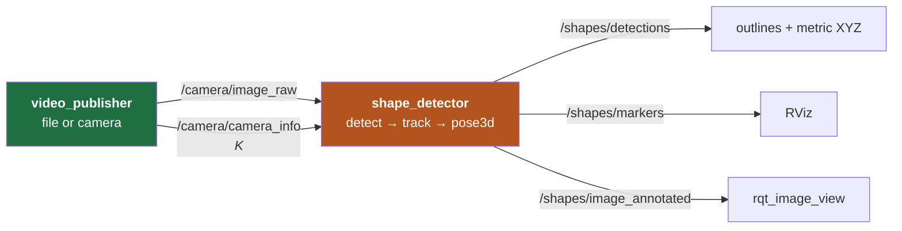

**The port is thin, and that is the point.** [`detect_video_3d.py`](detect_video_3d.py) was
already built around a streaming contract — one frame in at a time, `detect()` a pure function
of that frame, all state in the tracker and the scale memory. A subscriber callback is that
same shape, so the body of the detector node is the six lines lifted verbatim from
`run()`:

```python
detections, _, _ = algo.detector.detect(frame)              # stateless, this frame only
tracks = self.tracker.update(detections, self.frame_idx)    # causal, past frames only
obs = [(t.id, t.label, t.area, algo.video3d.measurable(t, frame.shape),
        algo.pose3d.circle_score(t.contour)) for t in tracks]
Z, src = self.plane.update(obs)
for t in tracks:
    t.xyz = self.plane.locate(t.center, Z) if Z else None
```

Everything else in the package is message plumbing. **No existing module was modified** — the
algorithm stays at the repository root and is imported from there, so `run_tests.py` and every
command above still work exactly as documented.

### Topics

| Topic | Type | What it carries |
|---|---|---|
| `/camera/image_raw` | `sensor_msgs/Image` | the frame |
| `/camera/camera_info` | `sensor_msgs/CameraInfo` | **K**, scaled to the published image |
| `/shapes/detections` | `pennair_msgs/ShapeDetectionArray` | outline, track ID, metric XYZ, depth provenance |
| `/shapes/detections_2d` | `vision_msgs/Detection2DArray` | the same, in a standard type |
| `/shapes/markers` | `visualization_msgs/MarkerArray` | centres, labels and **outlines in 3D** |
| `/shapes/image_annotated` | `sensor_msgs/Image` | the familiar overlay |

Positions are published in **metres** (REP-103); the algorithm works in inches and converts at
the publish boundary only. The outline in `ShapeDetection` is the refined contour itself, not a
polygon approximation of it — the same points the centre and the area were measured from. For
RViz those points are back-projected onto the plane, which is exact because the plane is
fronto-parallel, so the marker is the shape's real outline in metres rather than a billboard.

### Three decisions worth defending

**Intrinsics travel on a topic.** The detector is not told in advance what calibration it is
working with; it reads K off `/camera/camera_info`. That is idiomatic ROS, and here it also
removes a specific way to be silently wrong. `scale:=0.5` downsamples frames so a VM can carry
the bandwidth — and intrinsics are measured *in pixels*, so a resized image needs a resized K.
`Camera.for_frame` already did that work in Part 4; the publisher calls it on the frame it is
about to send. Without it, half-scale streaming would report every shape at twice its distance
and nothing would look obviously broken.

**Dropping frames is the correct behaviour.** Both subscriptions use best-effort, depth-1 QoS.
The 3D pipeline runs ~12 fps against a publisher that does not wait for it, so the node always
works on the newest frame and discards the backlog. A reliable, deep queue would instead
accumulate unbounded lag and confidently report positions for a scene that had already moved
on. This is also the first time the streaming contract is genuinely *tested* rather than merely
respected: frames really do arrive asynchronously now.

**Two packages, not one.** Custom `.msg` files can only be generated from an `ament_cmake`
package, so the interfaces live in `pennair_msgs` and the nodes in `pennair_vision`.

### Running it

Needs a ROS 2 environment. [`ROS2_SETUP.md`](ROS2_SETUP.md) walks through building one from a
blank Mac — UTM VM, Ubuntu 24.04 ARM64, ROS 2 Jazzy — in about an hour.

```bash
cd ros2_ws && colcon build --symlink-install && source install/setup.bash

ros2 launch pennair_vision shapes.launch.py \
    video:=$HOME/pennair/"PennAir 2024 App Dynamic Hard.mp4" \
    principal_point:=center rviz:=true
```

```bash
ros2 topic echo /shapes/detections --once     # 5 detections, plane_depth ~6.39
ros2 run rqt_image_view rqt_image_view        # -> /shapes/image_annotated
python3 -m pytest src/pennair_vision/test/test_ros_pipeline.py -s
```

**The number that proves the port.** The CLI reports a plane depth of 251.74 in on this footage.
`/shapes/detections` must show `plane_depth ≈ 6.39` m. Anything else points at the K scaling or
the unit conversion — in this package — rather than at the detector.

### What went wrong here

| Problem | Cause | Fix |
|---|---|---|
| `cv_bridge` fails to import with an ABI error | Ubuntu 24.04 ships `cv_bridge` compiled against the *system* NumPy and OpenCV. A `pip install opencv-python` pulls NumPy 2.x alongside it and the two disagree | Install `python3-opencv` from apt and never pip into the system Python. PEP 668 is trying to tell you this; do not reach for `--break-system-packages` |
| Every RViz marker sits off to one side | The supplied K has `cx = cy = 0`, so X and Y are measured from the top-left pixel's ray — as documented in [the principal-point note](#a-note-on-the-principal-point) | `principal_point:=center`. Depth is unchanged either way |
| 1080p at 30 Hz saturates DDS in a VM | Raw `sensor_msgs/Image` at that size is 186 MB/s | Default `scale: 0.5`, `rate: 10` → ~15 MB/s. Safe only because K scales with the image |

## How it was built

Two habits did most of the work.

**Look at the intermediate images.** A CV pipeline is a chain of transformations, and reading
the code rarely tells you which link broke. `--debug` writes the texture map and binary mask on
every script. "Otsu returned 0 shapes" is nearly opaque in code; one look at the mask — a white
frame speckled with black dots — made it obvious in seconds.

**Validate against something that shares no assumptions.** "It looks right" is not a
measurement, and there was no ground truth. So: a second detector that counts shapes by
matching known fill colours. It would be useless as a detector — it only works because it was
told the answers — and that is exactly what makes it a fair check. It agreed at **recall 0.980,
precision 0.980**, and more usefully it *found the next bug*: listing every miss showed 5 of 12
were at frame 0, where all five shapes are plainly visible and simply hadn't satisfied the
tracker's 3-frame confirmation delay yet.

A recurring theme worth naming, because it came up three separate times:

> When one metric's margin is uncomfortably thin, look for a **second signal that fails
> differently** rather than tuning the first threshold harder.

That is the circle test (circularity + vertex-count agreement), the tracker's matching
(position + appearance), and the agnostic verifier (edge contrast + smoothness).

---

## Results

| | Static | Video (grass) | Video (hard) | Video (hard, 3D) |
|---|---|---|---|---|
| Detector | `detect_shapes.py` | `detect_video.py` | `detect_video_agnostic.py` | `detect_video_3d.py` |
| Shapes found | 5/5 | recall 98.0% | recall 93.3% | recall 93.3% |
| Classification | 5/5 | 98.8% | 89.3% | 89.3% |
| Centre accuracy | — | median 2.0 px | median 2.2 px | median 2.2 px |
| False positives | 0 | precision 98.0% | 0 | 0 |
| Metric position | — | — | — | **every frame** |
| Depth error vs truth | — | — | — | **0.3%** (synthetic) |
| Throughput (1080p) | — | 30 fps | 12 fps | 12 fps |

Throughput is whatever the machine gives you; the numbers above are from one laptop and
`run_tests.py` reports yours. The 3D stage is free — it adds one square root and two divisions
per shape, and does not move the detection or classification numbers at all, which is the point
of keeping it a separate stage.

Outputs: `output_static.png`, `output_static_3d.png`, `output_dynamic.mp4`, `output_hard.mp4`,
`output_hard_3d.mp4`, plus a per-frame CSV (`frame, track_id, shape, cx, cy, area, state,
confidence`) that gains `X_in, Y_in, Z_in, depth_source` in the 3D pipeline.

## Trade-offs: which one to use

| | Specialised | Agnostic |
|---|---|---|
| Known textured ground, flat shapes | **98.8% class · 30 fps** | 86.6% · 12 fps |
| Asphalt + gradient fills | 4/5, misnamed | **93.3%, correct** |
| Smooth or unknown background | fails | **works** |

Background independence costs about 3.5× in speed and ~12 points of classification accuracy —
concentrated almost entirely on the trapezoid, whose weak boundary lets the watershed bulge
slightly, and each bulge reads as an extra vertex. Contour smoothing, larger kernels, shifted
`approxPolyDP` ranges and a best-fit-polygon classifier were all tried and measured; none beat
the current settings, so it is reported as a real weakness rather than a solved problem.

**Both are kept**, because they are better at different jobs. A drone in flight does not know
what it is flying over, which is the case the agnostic version exists for.

The 3D stage sits on top of the agnostic one for the same reason, and it is deliberately a
*layer* rather than a rewrite: `detect_video_3d.py` imports the tracker and the detector
unchanged and adds a stage after them. Detection quality and calibration quality are then
independently testable, and the new code cannot perturb a pipeline that already worked.

## Known limits

- Occluded classification needs a prior clean view of the shape.
- Two same-coloured shapes crossing could swap IDs.
- Constant-velocity motion model: a sharp turn during a long occlusion is mispredicted.
- Occlusion tolerance caps at ~0.7 s, after which a track retires and returns with a new ID.
- The convex-hull occlusion recovery assumes convex shapes — true of all five here.
- No ego-motion compensation: velocities are image-space while the camera itself pans.

And on the 3D stage specifically:

- **Fronto-parallel** — one depth for the whole plane. A tilted plane would need a per-shape
  depth or a proper plane fit; the code has the pieces (`Camera.metric_area` inverts to a
  per-shape Z) but the assumption is not currently checked.
- **Camera frame, not world frame.** These are (X, Y, Z) relative to the camera. Converting to
  world coordinates needs the drone's pose — attitude and position — which the brief does not
  supply. That is now the only missing input, not a missing algorithm.
- **The circle must appear at least once**, or there is no scale at all. Everything after that
  is carried forward.
- **No lens distortion model.** K is given without distortion coefficients, so none is applied;
  a real wide-angle lens would need `cv2.undistort` before any of this.
- **Range is capped by the detector at ~33 ft** at 1080p, measured above — not by the maths.
