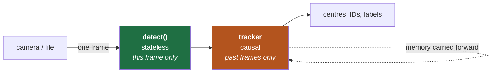
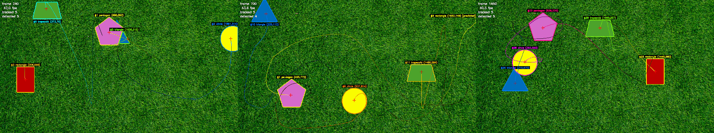
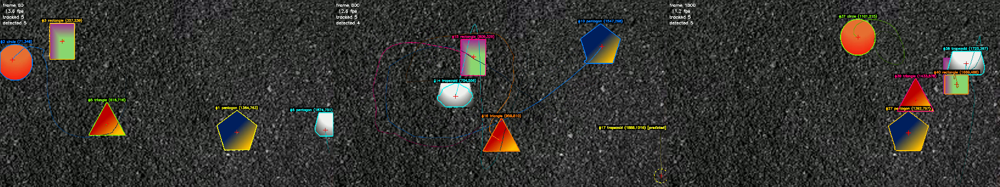

# PennAir 2024 Software Challenge — Shape Detection

Detecting shapes on a grassy background, marking their centres, tracking them through video,
and then making the whole thing work on **any** background.


| Deliverable | Result |
|---|---|
| **Static image** — detect shapes, mark centres | 5/5 detected, classified and centred |
| **Video** — streamed frame by frame | **42 fps** on a 30 fps source · recall **98.0%** · classification **98.8%** |
| **Background-agnostic** — any colour/texture | **97.8%** recall over 9 backgrounds × 2 fill types · 0 misclassifications |

```bash
pip install opencv-python
python3 detect_shapes.py            # static image
python3 detect_video.py             # video, with tracking
python3 detect_video_agnostic.py    # any background
python3 test_backgrounds.py         # the agnosticism test suite
```

---

## In 60 seconds

The shapes cannot be found by **colour** — one of them is the same green as the grass. They can
be found by **texture**: grass is thousands of tiny blades, the shapes are smooth. That one
observation drives everything:

1. **Find** shapes as regions of unusually low local texture.
2. **Sharpen** their outlines against the original pixels, because step 1 is blurry at the edges.
3. **Measure** centres from image moments, classify from polygon geometry.
4. For video, add **memory** — track each shape across frames so a moment of occlusion cannot
   lose it or rename it.
5. For arbitrary backgrounds, replace every assumption about what the background and the shapes
   *look like* with measurements that are **relative to the frame itself**.

---

## What's in this repo

| File | What it is |
|---|---|
| [`detect_shapes.py`](detect_shapes.py) | Static-image detector. Also the per-frame detector for video |
| [`detect_video.py`](detect_video.py) | Streaming pipeline + tracker |
| [`detect_shapes_agnostic.py`](detect_shapes_agnostic.py) | Background-agnostic redesign |
| [`detect_video_agnostic.py`](detect_video_agnostic.py) | Streaming version of the above |
| [`test_backgrounds.py`](test_backgrounds.py) | Renders shapes on 9 synthetic backgrounds and scores the result |
| [`make_figures.py`](make_figures.py) | Regenerates every figure in this README |

**Reports** — short: [`STATIC_IMAGE_REPORT.md`](STATIC_IMAGE_REPORT.md) ·
[`VIDEO_REPORT.md`](VIDEO_REPORT.md) · [`BACKGROUND_AGNOSTIC.md`](BACKGROUND_AGNOSTIC.md)
**Deep dives** — [`ALGORITHM.md`](ALGORITHM.md) · [`VIDEO_DETECTION.md`](VIDEO_DETECTION.md)
**Talking it through out loud** — [`VIDEO_DETECTION_SIMPLE.md`](VIDEO_DETECTION_SIMPLE.md)

The original detector is kept unchanged alongside the agnostic one. They are better at
different jobs — see [trade-offs](#trade-offs-which-one-to-use).

---

## The one idea everything rests on


The instinctive approach is to threshold out the green background in HSV. It fails here, and
the middle panel shows why: **the trapezoid is the same hue as the grass.** Any threshold wide
enough to erase the lawn erases the trapezoid too.

The right panel is the same scene measured by *local texture* instead. Every shape is a black
hole in a field of noise — including the green one. Texture separates all five at once,
regardless of colour.

| | Grass | Green trapezoid |
|---|---|---|
| Hue | ~60° | ~60° — **identical** |
| Local intensity variation | 13.0 | **0.0** |

> **Interview note.** The whole design follows from choosing a discriminator that doesn't
> collide with the thing you're looking for. Colour collides here; texture does not.

---

## Part 1 — Static image


**Stage 1 — find them by smoothness.** For every pixel, compute the standard deviation of its
neighbourhood. Rather than loop over pixels, use `Var(X) = E[X²] − E[X]²` where both terms are
box filters — two convolutions, milliseconds instead of seconds. Threshold, then clean up with
morphology.

**Stage 2 — sharpen the outline.** Stage 1's boundary is wrong in two ways: the measuring
window straddles each edge (so the region is inset ~5 px) and the morphology rounds off
corners. Fix: use the blurry region only to *sample the shape's fill colour*, then recover the
boundary by colour distance against the original pixels. Sharp corners come back.

**Stage 3 — centres.** Image moments: `cx = M10/M00`. This is the true area centroid, not the
bounding-box middle — which would be visibly wrong for the triangle, whose centroid sits ⅓ of
the way up from its base.

**Stage 4 — classify.** Circularity `4πA/P²` identifies the circle; a sweep of `approxPolyDP`
tolerances votes on vertex count for polygons; comparing opposite side lengths separates
rectangle from trapezoid.

| Shape | Centre | Area | Check |
|---|---|---|---|
| pentagon | (691, 344) | 8791 px | ~110 px across ✓ |
| trapezoid | (839, 148) | 5641 px | ~90 × 65 ✓ |
| triangle | (279, 320) | 5595 px | base 110, height 102 ✓ |
| circle | (553, 104) | 5122 px | r = 40.4 → 81 px diameter ✓ |
| rectangle | (112, 76) | 3564 px | 51 × 70 ✓ |

### What went wrong here

| Problem | Cause | Fix |
|---|---|---|
| **Otsu returned zero shapes** | Otsu needs two comparably-sized classes. The shapes are ~5% of the frame, so it split the *grass* distribution in half and called the lawn flat | Threshold relative to the background's own roughness: `0.35 × median(σ)`. Self-calibrating, so it also survives different lighting |
| **Triangle classified as "trapezoid"** | Morphology rounded its corners, so `approxPolyDP` invented vertices | The colour-refinement stage (Stage 2) exists because of this |
| **Circle test had a 0.05 margin** | A regular pentagon's ideal circularity is 0.865 — *above* the 0.85 threshold. It only worked because rasterised contours measure slightly rounder-than-ideal | Added a second, independent signal: a circle's vertex count never settles (11/18 agreement) while a polygon's is unanimous (18/18) |
| **Areas ~20% too small** | Measured on the pre-refinement region | Measure the refined contour. Caught by sanity-checking areas against visible pixel dimensions |

---

## Part 2 — Video

The brief was to treat the video as a **live drone feed**, which rules out three tempting
things: seeking to arbitrary frames, a second pass, and looking at future frames. So there is
exactly one place a frame enters, and no `cap.set()` anywhere in the pipeline:

```python
while True:
    ok, frame = cap.read()      # one frame at a time; nothing else is available
```

The proof it was respected: `python3 detect_video.py 0` runs a live webcam through the identical
code path.



Detection stays a **pure function of one frame** — the same function the static script calls —
so a bad frame can't corrupt later ones and any failure reproduces from a single image. All
state lives in the tracker, which keeps the only place a causality bug could hide small.

### The problem a single frame cannot solve


When shapes overlap, both are smooth, so the texture stage sees **one** region — that keyhole.
No amount of tuning fixes it, because as far as texture is concerned they really are one
region. But they are different *colours*, and Stage 2 already samples fill colour. Dropping the
assumption of one colour per blob splits them (k-means, guarded so a single shape is never
split).

That recovers two centres. It does **not** recover the rectangle's identity — with a bite taken
out of it, its visible outline genuinely is a five-sided polygon, and no per-frame method can
know otherwise.

### What memory buys



The tracker gives each shape a persistent ID, a smoothed centre, a motion trail, and a **voted
label** — the majority over ~1.5 s, counting only frames where the whole shape is visible.
That last guard is the important part: letting a clipped outline vote would let noise rename
the shape.

| Classification accuracy | |
|---|---|
| Per-frame, no temporal help | 86.6% |
| **After temporal voting** | **98.8%** |

An 11× reduction in error rate, from information that was already present and simply unused.
A shape being *predicted* rather than measured is drawn dashed and labelled `[predicted]`, so
the overlay never presents an inference as an observation.

### What went wrong here

| Problem | Cause | Fix |
|---|---|---|
| **Found 3 of 5 shapes** | Overlapping shapes merged into one blob | Split merged blobs by fill colour |
| **47 tracks for 5 shapes** | Matching on position alone. An occluded shape's centroid *lurches*, and a lurch past the gate makes the tracker drop it and re-acquire it as a new ID | Match on position **and** colour. Colour is untouched by occlusion, so it holds identity exactly when position becomes unreliable → 29 tracks |
| **Ragged trapezoid → "hexagon"** | Its olive fill sits only 80 units from grass in colour space (others: 180–260), so grass pixels leak through and fray the outline | The leak is *speckle*; the shape is *solid*. A morphological opening removes one and keeps the other. A tighter colour threshold was tried and measured — it did not help |
| **Ran at 7 fps** | Profiling showed both hotspots were somewhere other than expected | See below |
| **Phantom tracks drifting off-screen** | Coasting tracks predicted out to x = 2322 on a 1920-wide frame | Retire a track once its predicted position leaves the frame |

### Making it real-time

The first working version ran at **137 ms/frame (7.3 fps)**. Rather than guess, profile:

| | Before | After | |
|---|---|---|---|
| Stage 1 | 76.9 ms | 12.6 ms | Cost was the *morphology*, not the variance — box filters are O(1) per pixel. Stage 1 only has to *locate*, so it runs downscaled |
| Stage 2 | 64.1 ms | 13.1 ms | A 101×101 dilation cost more than everything else combined; replaced with a cheap overlap test |
| **Full frame** | **137.1 ms** | **24.1 ms** | **5.7× — with bit-identical detections** |

Nothing was traded for speed; work that wasn't buying anything was removed. End to end,
including tracking and drawing: mean 23.8 ms, **p95 29.6 ms, max 39.4 ms** — for a live feed
the tail matters more than the mean, and the worst frame of 1837 still cleared the 33 ms
deadline.

---

## Part 3 — Background-agnostic

`PennAir 2024 App Dynamic Hard.mp4` changes the ground to dark asphalt **and** makes the shapes
gradient-filled. Run unchanged, the original finds 4 of 5 and misnames them:

```
old: ['circle', 'trapezoid', 'rectangle', 'hexagon']              <- pentagon + triangle lost
new: ['pentagon', 'circle', 'rectangle', 'trapezoid', 'triangle']
```


Both failures have one root cause: **a smooth gradient looks exactly like texture to a variance
measure.** A ramp has a large standard deviation while containing no detail at all. The middle
panel shows the consequence — the triangle vanishes and the pentagon is half-eaten.

The fix is to change the question from *"is this flat?"* to **"is this free of fine detail?"** —
true of a flat fill and a gradient alike. Subtract a blurred copy first: a gradient survives a
blur and cancels out, texture does not.

| | Background (asphalt) | Worst shape interior | Separation |
|---|---|---|---|
| Original variance | 18.07 | 8.47 | 2.13× — marginal |
| **High-pass residual** | 11.01 | **2.45** | **4.50×** |

### Every assumption, replaced

| Original assumed | Agnostic version uses | Why |
|---|---|---|
| Background is textured | Texture cue **+** an enclosure cue | A smooth background (water, asphalt, sky) has no texture to contrast against |
| Shapes are flat | High-frequency residual | Works for flat *and* gradient fills |
| One fill colour per shape | **Watershed** on the image gradient | Needs no colour model at all |
| Colour clustering to split overlaps | **Distance-transform maxima** | A gradient has more internal colour spread than the gap between two shapes |
| Mean colour for track identity | **Colour histogram** | Records *which* colours are present instead of averaging them away |

The organising principle is **pairs of cues that fail in opposite circumstances**, with the
detector choosing between them from measurements rather than from a setting.



### Proving it, on backgrounds nobody supplied

Real footage only covers two backgrounds. [`test_backgrounds.py`](test_backgrounds.py) renders
the same shapes over nine synthetic ones — smooth, textured, light, dark, patterned — with both
flat and gradient fills. Ground truth is exact because the scene is generated.

**Recall 97.8% (88/90) · 0 misclassifications · mean centre error 0.3 px**, on one unchanged
parameter set covering solid colours, smooth gradients, sand, gravel, grass, wood grain and a
checkerboard.

### What went wrong here

| Problem | Cause | Fix |
|---|---|---|
| **0/5 on every smooth background** | `RETR_EXTERNAL` returns only outermost contours. On smooth ground the shapes are regions *nested inside* the background region, so it never returned them | Connected-component labelling, which doesn't care about nesting. Synthetic recall 44% → 78% |
| **A region swallowed 1.8M of 2.07M pixels** | Filling the edge map's outer contour — on textured ground the edges form one connected web spanning the frame | Read enclosure as the *complement* of the edge map |
| **Triangle → hexagon, 13% too small** | Watershed clearance too small: sharp corners poked outside the cleared band and were labelled certain background | Clearance is genuinely two-sided (too large leaks across weak edges, overshooting by 37%). Resolved using convexity: try widest first, accept the first result that is still convex |
| **195 tracks for 5 shapes** | Accepting a candidate on *either* verifier imported the weaker one's false positives | The two verifiers aren't interchangeable — on textured ground smoothness is decisive, on smooth ground only the edge test says anything. Pick per candidate by measuring local roughness → **zero** false positives |
| **64 false positives on a checkerboard** | Its cells are genuinely shape-like: uniform inside, bounded by a strong edge | What gives them away is that there are dozens, all alike. A large group sharing a class and size is read as background pattern |

---

## How it was built

Two habits did most of the work.

**Look at the intermediate images.** A CV pipeline is a chain of transformations, and reading
the code rarely tells you which link broke. `--debug` writes the texture map and binary mask on
every script. "Otsu returned 0 shapes" is nearly opaque in code; one look at the mask — a white
frame speckled with black dots — made it obvious in seconds.

**Validate against something that shares no assumptions.** "It looks right" is not a
measurement, and there was no ground truth. So: a second detector that counts shapes by
matching known fill colours. It would be useless as a detector — it only works because it was
told the answers — and that is exactly what makes it a fair check. It agreed at **recall 0.980,
precision 0.980**, and more usefully it *found the next bug*: listing every miss showed 5 of 12
were at frame 0, where all five shapes are plainly visible and simply hadn't satisfied the
tracker's 3-frame confirmation delay yet.

A recurring theme worth naming, because it came up three separate times:

> When one metric's margin is uncomfortably thin, look for a **second signal that fails
> differently** rather than tuning the first threshold harder.

That is the circle test (circularity + vertex-count agreement), the tracker's matching
(position + appearance), and the agnostic verifier (edge contrast + smoothness).

---

## Results

| | Static | Video (grass) | Video (hard) |
|---|---|---|---|
| Detector | `detect_shapes.py` | `detect_video.py` | `detect_video_agnostic.py` |
| Shapes found | 5/5 | recall 98.0% | recall 93.3% |
| Classification | 5/5 | 98.8% | 89.3% |
| Centre accuracy | — | median 2.0 px | median 2.2 px |
| False positives | 0 | precision 98.0% | 0 |
| Throughput (1080p) | — | **42 fps** | 12 fps |

Outputs: `output_static.png`, `output_dynamic.mp4`, `output_hard.mp4`, plus a per-frame CSV
(`frame, track_id, shape, cx, cy, area, state, confidence`).

## Trade-offs: which one to use

| | Specialised | Agnostic |
|---|---|---|
| Known textured ground, flat shapes | **98.8% class · 42 fps** | 86.6% · 12 fps |
| Asphalt + gradient fills | 4/5, misnamed | **93.3%, correct** |
| Smooth or unknown background | fails | **works** |

Background independence costs about 3.5× in speed and ~12 points of classification accuracy —
concentrated almost entirely on the trapezoid, whose weak boundary lets the watershed bulge
slightly, and each bulge reads as an extra vertex. Contour smoothing, larger kernels, shifted
`approxPolyDP` ranges and a best-fit-polygon classifier were all tried and measured; none beat
the current settings, so it is reported as a real weakness rather than a solved problem.

**Both are kept**, because they are better at different jobs. A drone in flight does not know
what it is flying over, which is the case the agnostic version exists for.

## Known limits

- Occluded classification needs a prior clean view of the shape.
- Two same-coloured shapes crossing could swap IDs.
- Constant-velocity motion model: a sharp turn during a long occlusion is mispredicted.
- Occlusion tolerance caps at ~0.7 s, after which a track retires and returns with a new ID.
- The convex-hull occlusion recovery assumes convex shapes — true of all five here.
- No ego-motion compensation: velocities are image-space while the camera itself pans.

The natural next step for real drone use isn't better detection — it's projecting centres into
**world coordinates**, which needs camera intrinsics and pose. The pixel centre this produces is
the input to that, not the end of it.
