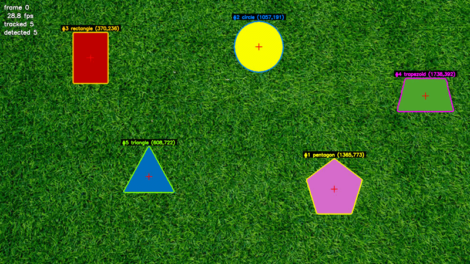
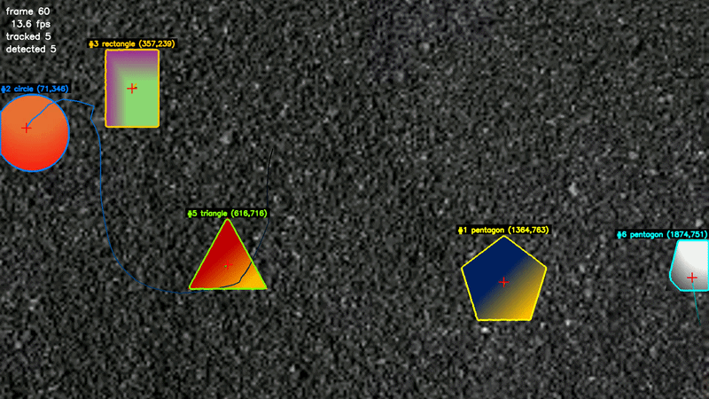
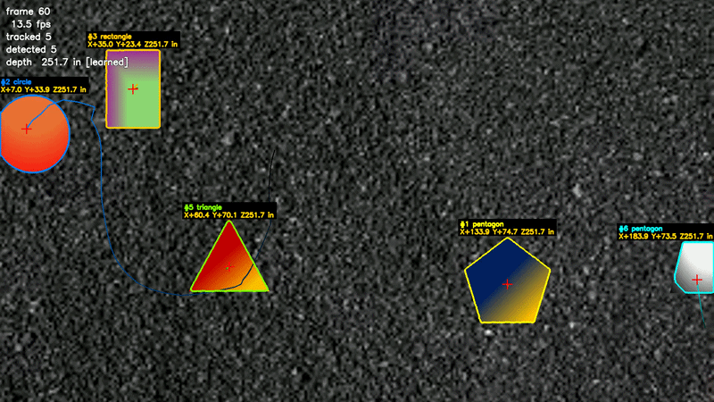
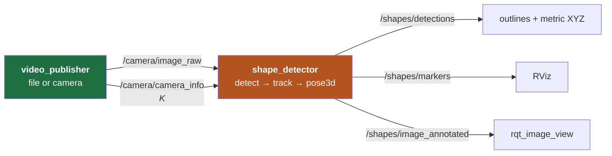

# PennAir 2024 Software Challenge — Shape Detection

Find shapes on a grassy background and mark their centres; track them through video; make it work
on any background; report each centre in meters rather than pixels; expose it as ROS 2 nodes.

Every number below regenerates from `python3 run_tests.py`. Figures measured against a
non-reproducible oracle are excluded — see [Measurement provenance](#measurement-provenance).

| Deliverable | Verified result | Evidence |
|---|---|---|
| **1 · Static image** | 5/5 found, named and centred | the supplied still |
| **2 · Video** | 4.87 shapes tracked/frame · 29 IDs for 5 shapes over 1837 frames · 24 ms/frame | grass footage |
| **3 · Background-agnostic** | **97.8%** recall · **0** misclassifications · 0.3 px centres | 90 synthetic instances, exact truth |
| **4 · 3D** | depth to **0.3%** of truth · **1841/1841** frames positioned | 60 synthetic instances + hard footage |
| **5 · ROS 2** | detections, outlines and metric XYZ on live topics | two nodes + launch file |

Deep dive, full reasoning and the complete failure log: [`DESIGN.md`](DESIGN.md).

---

## How to run

```bash
pip install opencv-python numpy
```

| # | Run it | Writes |
|---|---|---|
| 1 | `python3 detect_shapes.py` | `output_static.png` |
| 2 | `python3 detect_video.py` | `output_dynamic.mp4`, `track_log.csv` |
| 3 | `python3 detect_video_agnostic.py` | `output_hard.mp4`, `track_log_hard.csv` |
| 4 | `python3 detect_video_3d.py` · `detect_3d.py` | `output_hard_3d.mp4`, `output_static_3d.png` |
| 5 | `ros2 launch pennair_vision shapes.launch.py` | live topics |

Any script takes its input as the first argument; `0` means the webcam.

```bash
python3 run_tests.py              # all four steps, ~50 s, exit code = failures
python3 run_tests.py --step 4     # one step; --step is repeatable
python3 run_tests.py --full       # whole videos, not the first 150 frames
```

| Step | What it verifies | Truth source |
|---|---|---|
| 1 | five shapes found, all named, centres inside the frame | the supplied still |
| 2 | ≥4.5 shapes tracked/frame, bounded per-frame cost, stable IDs | grass footage |
| 3 | ≥95% recall, 0 misclassifications over 9 backgrounds × 2 fills | generated scenes — exact |
| 4 | depth, position, scale bootstrap, resolution invariance, projection algebra, envelope, altitude tracking | metric truth projected through K |

ROS 2 needs a Linux environment — [`ROS2_SETUP.md`](ROS2_SETUP.md) builds one from a blank Mac.

---

## Core principle

The shapes cannot be separated by **color**: the trapezoid is the same hue as the grass. They can
be separated by **texture**, because grass is thousands of tiny blades and the shapes are smooth.


| | Grass | Green trapezoid |
|---|---|---|
| Hue | ~60° | ~60° — **identical** |
| Local intensity variation | 13.0 | **0.0** |

The discriminator must not correlate with the target. color does here; texture does not.

---

## Part 1 — Static image


1. **Locate** by smoothness — per-pixel neighbourhood standard deviation via `Var(X) = E[X²] − E[X]²`, two box filters rather than a per-pixel loop. Threshold at `0.35 × median(σ)`, relative to the frame's own roughness, then clean up with morphology.
2. **Sharpen** the outline — stage 1's boundary is inset ~5 px by the measuring window and rounded by morphology. Use the blurry region only to sample fill color, then recover the boundary by color distance against the original pixels.
3. **Centre** by image moments, `cx = M10/M00` — the true area centroid, not the bounding-box middle, which is visibly wrong for the triangle.
4. **Classify** — circularity `4πA/P²` finds the circle; a sweep of `approxPolyDP` tolerances votes on vertex count; opposite side lengths separate rectangle from trapezoid.

| Shape | Centre | Area | Cross-check |
|---|---|---|---|
| pentagon | (691, 344) | 8791 px | ~110 px across ✓ |
| trapezoid | (839, 148) | 5641 px | ~90 × 65 ✓ |
| triangle | (279, 320) | 5595 px | base 110, height 102 ✓ |
| circle | (553, 104) | 5122 px | r = 40.4 → 81 px diameter ✓ |
| rectangle | (112, 76) | 3564 px | 51 × 70 ✓ |

### Failures and fixes

| Problem | Cause | Fix |
|---|---|---|
| **Otsu returned zero shapes** | Otsu needs two comparably-sized classes; the shapes are ~5% of the frame, so it split the *grass* distribution and called the lawn flat | Threshold relative to the background's own roughness: `0.35 × median(σ)`. Self-calibrating, so it also survives different lighting |
| **Triangle classified as "trapezoid"** | Morphology rounded its corners, so `approxPolyDP` invented vertices | The color-refinement stage exists because of this |
| **Circle test had a 0.05 margin** | A regular pentagon's ideal circularity is 0.865 — *above* the 0.85 threshold. It only worked because rasterised contours measure rounder than ideal | Added an independent signal: a circle's vertex count never settles (11/18 agreement), a polygon's is unanimous (18/18) |
| **Areas ~20% too small** | Measured on the pre-refinement region | Measure the refined contour. Caught by sanity-checking areas against visible pixel dimensions |

---

## Part 2 — Video



*Persistent IDs, motion trails, and shapes recovering their names after an occlusion. Full
resolution: [`output_dynamic_CLIP.mp4`](output_dynamic_CLIP.mp4).*

Treating the video as a live drone feed rules out seeking, a second pass, and looking ahead. One
place a frame enters, and no `cap.set()` in the pipeline:

```python
while True:
    ok, frame = cap.read()      # one frame at a time; nothing else is available
```

Detection stays a **pure function of one frame** — the same function the static script calls — so
a bad frame cannot corrupt later ones and any failure reproduces from a single image. All state
lives in the tracker. `python3 detect_video.py 0` runs a live webcam through the identical code
path.

**Merged detections.**


Overlapping shapes are both smooth, so the texture stage sees one region. They are different
*colors*, and stage 2 already samples fill color, so dropping the one-color-per-blob assumption
splits them (k-means, guarded so a single shape is never split). That recovers two centres but not
the rectangle's identity — with a bite taken out of it, its visible outline *is* a five-sided
polygon.

**Temporal tracking.** Each shape gets a persistent ID, a smoothed centre, a motion trail, and a
label voted over ~1.5 s counting only frames where the whole shape is visible. The guard is
necessary: a clipped outline would let noise relabel the shape. A shape being *predicted* rather
than measured is drawn dashed and labelled `[predicted]`, so the overlay never presents an
inference as an observation.

Over 1837 frames: **4.87 shapes tracked per frame**, **29 distinct IDs** for 5 shapes — 27 of the
29 births and deaths occur at the frame edge, consistent with a continuous pan.

**Performance.** The first working version ran at 137 ms/frame. Profiling located both hotspots
away from where they were expected:

| | Before | After | |
|---|---|---|---|
| Stage 1 | 76.9 ms | 12.6 ms | Cost was the *morphology*, not the variance. Stage 1 only locates, so it runs downscaled |
| Stage 2 | 64.1 ms | 13.1 ms | A 101×101 dilation cost more than everything else combined; replaced with a cheap overlap test |
| **Full frame** | **137.1 ms** | **24.1 ms** | **5.7× — with bit-identical detections** |

No accuracy was traded for speed; the removed work was not contributing to the result.

### Failures and fixes

| Problem | Cause | Fix |
|---|---|---|
| **Found 3 of 5 shapes** | Overlapping shapes merged into one blob | Split merged blobs by fill color |
| **47 tracks for 5 shapes** | Matching on position alone. An occluded shape's centroid *lurches*, and a lurch past the gate makes the tracker drop and re-acquire it | Match on position **and** color. color is untouched by occlusion, so it holds identity exactly when position becomes unreliable → 29 tracks |
| **Ragged trapezoid → "hexagon"** | Its olive fill sits 80 units from grass in color space (others 180–260), so grass pixels leak through and fray the outline | The leak is *speckle*, the shape is *solid* — a morphological opening removes one and keeps the other. A tighter color threshold was tried and measured; it did not help |
| **Ran at 7 fps** | Both hotspots were somewhere other than expected | Profile, then fix — see above |
| **Phantom tracks drifting off-screen** | Coasting tracks predicted out to x = 2322 on a 1920-wide frame | Retire a track once its predicted position leaves the frame |

---

## Part 3 — Background-agnostic



*The same ten seconds as the 3D clip in Part 4, so the two can be compared directly. Full
resolution: [`output_hard_CLIP.mp4`](output_hard_CLIP.mp4).*

`PennAir 2024 App Dynamic Hard.mp4` changes the ground to asphalt **and** makes the shapes
gradient-filled. Run unchanged, the original finds 4 of 5 and misnames them:

```
old: ['circle', 'trapezoid', 'rectangle', 'hexagon']              <- pentagon + triangle lost
new: ['pentagon', 'circle', 'rectangle', 'trapezoid', 'triangle']
```


One root cause: **a smooth gradient looks like texture to a variance measure.** A ramp has a large
standard deviation while containing no detail. The fix changes the question from *"is this flat?"*
to **"is this free of fine detail?"** — true of a flat fill and a gradient alike. Subtract a
blurred copy first: a gradient survives a blur and cancels; texture does not.

| | Background (asphalt) | Worst shape interior | Separation |
|---|---|---|---|
| Original variance | 18.07 | 8.47 | 2.13× — marginal |
| **High-pass residual** | 11.01 | **2.45** | **4.50×** |

### Assumptions replaced

| Original assumed | Agnostic version uses | Why |
|---|---|---|
| Background is textured | Texture cue **+** an enclosure cue | A smooth background has no texture to contrast against |
| Shapes are flat | High-frequency residual | Works for flat *and* gradient fills |
| One fill color per shape | **Watershed** on the image gradient | Needs no color model |
| color clustering to split overlaps | **Distance-transform maxima** | A gradient has more internal color spread than the gap between two shapes |
| Mean color for track identity | **color histogram** | Records *which* colors are present instead of averaging them away |

The organising principle is **pairs of cues that fail in opposite circumstances**, with the
detector choosing between them from measurements rather than from a setting.

### Watershed refinement

color thresholding is replaced by a watershed flood. Markers declare what is certainly inside and
certainly outside; the image decides the boundary between them. No fill-color model is needed,
which is what makes it work on the gradient-filled pentagon below.


The seed's own outline is rough, yet the result is sharp. The seed never reaches the output: what
shapes the boundary is the gradient terrain the flood runs over, and that terrain is razor sharp
regardless of how approximate the starting marker was.


### Proof on unseen backgrounds

Real footage covers two backgrounds. [`test_backgrounds.py`](test_backgrounds.py) renders the same
shapes over nine synthetic ones — smooth, textured, light, dark, patterned — with both flat and
gradient fills. Ground truth is exact because the scene is generated, and each truth centroid is
read back from that shape's own rendered mask rather than the anchor it was drawn around.

**Recall 97.8% (88/90) · 0 misclassifications · mean centre error 0.3 px**, on one unchanged
parameter set covering solid colors, gradients, sand, gravel, grass, wood grain and a
checkerboard. The 13 false positives are all checkerboard cells.

On the hard footage: **4.85 shapes tracked per frame** with all five named correctly.


### Failures and fixes

| Problem | Cause | Fix |
|---|---|---|
| **0/5 on every smooth background** | `RETR_EXTERNAL` returns only outermost contours. On smooth ground the shapes are nested *inside* the background region, so it never returned them | Connected-component labelling, which does not care about nesting. Synthetic recall 44% → 78% |
| **A region swallowed 1.8M of 2.07M pixels** | Filling the edge map's outer contour — on textured ground the edges form one connected web spanning the frame | Read enclosure as the *complement* of the edge map |
| **Triangle → hexagon, 13% too small** | Watershed clearance too small: sharp corners poked outside the cleared band and were labelled certain background | Clearance is two-sided (too large leaks across weak edges, overshooting by 37%). Resolved by convexity: try widest first, accept the first result still convex |
| **195 tracks for 5 shapes** | Accepting a candidate on *either* verifier imported the weaker one's false positives | The verifiers are not interchangeable — on textured ground smoothness is decisive, on smooth ground only the edge test says anything. Pick per candidate by measuring local roughness → **zero** false positives |
| **64 false positives on a checkerboard** | Its cells are shape-like: uniform inside, bounded by a strong edge | What gives them away is that there are dozens, all alike. A large group sharing a class and size reads as background pattern → 13, all cells clipped by the frame edge, which vary in size and so never form a group |

---

## Part 4 — Three dimensions



*The same ten seconds as Part 3, now carrying X, Y and Z. Watch the depth source in the corner
switch between `[circle]` and `[learned]` as the ruler leaves and re-enters view — the number
barely moves. Full resolution: [`output_hard_3d_CLIP.mp4`](output_hard_3d_CLIP.mp4).*

Given `K = [[2564.3186869, 0, 0], [0, 2569.70273111, 0], [0, 0, 1]]`, a circle of radius 10 in,
and a flat surface. Intrinsics turn a pixel into a **ray**; the known radius fixes **how far along
it**:

```
Z = R · √(π · fx · fy / A_px)          depth, from the circle's pixel area
X = (u − cx) · Z / fx                  then the ray, scaled to that depth
Y = (v − cy) · Z / fy
```

| | Static image | Hard video (1841 frames) |
|---|---|---|
| Plane depth | **318.4 in** (26.5 ft) | **251.7 in** (21.0 ft) |
| Frames with a position | 1/1 | **1841/1841 — 100%** |
| By the circle · by a learned ruler | 1 · 0 | 1150 · 660 (31 held) |
| Steadiness, camera holding altitude | — | sd **0.34%**, median frame **0.02%** off |

### Design decisions

**Depth from area, not a radius.** A circle projects to an ellipse of semi-axes `fx·R/Z` and
`fy·R/Z`, so its area is `π·fx·fy·R²/Z²`. Reading `Z` off that uses every boundary pixel; a
measured radius uses one or two. The relation generalises: for an arbitrary metric area `A_m`, `Z
= √(fx·fy·A_m/A_px)`, on which the scale bootstrap depends.

**Intrinsics scale with the image.** `fx ≈ 2564 px` is a measurement *in pixels*, belonging to
1920-wide footage; the supplied still is 960 wide. Using K unchanged on both reports the still
twice as far away, and `--scale 0.5` would silently change the answer. `Camera.for_frame` scales K
by the frame's own width.

**The circle is corroborated, not trusted.** A misread does not lose the scale, it **falsifies**
it: a regular pentagon fills 0.757 of its circumcircle, so one read as the 10 in circle reports
the scene ~15% further away, with no observable symptom. The label is checked against contour area
÷ enclosing-circle area — 0.947–0.957 for the circle versus 0.753 for the runner-up. Circularity
`4πA/P²` is the wrong second test: built on perimeter, it is weakest exactly when segmentation is
shaky.

### Carrying the scale forward

The ruler need not be present, only to have been present. While the circle is in view its depth
also reveals the true size of every other shape on the plane, and a shape of known size is a ruler
thereafter. Only a whole, unobstructed outline qualifies: area is the entire measurement, so a
shape showing half of itself reports being 41% further away.

Fusing those stand-ins by median is the obvious approach and is insufficient. Once the circle has
gone there are usually two rulers, so the median is their average and one bad reading moves the
answer by half its error. Listing the bad frames showed a correct estimate beside the wrong one
every time — and the wrong one always had a jittery size history (interquartile spread 13–30%,
against 0.2–0.7% for the good ones). So pick rather than average, on two signals that fail
differently: **ruler steadiness**, and **continuity**, since the plane does not teleport.
Continuity only chooses *between* independent measurements and never invents one; the circle
overrides it whenever visible.


*Left, depth measured from the circle. Right, the circle occludes the rectangle and a learned
ruler carries the scale — the two agree to 0.4 in at 21 ft.*

| Fusion rule | sd | frames >5% out | worst frame |
|---|---|---|---|
| median of everything in view | 1.57% | 1.30% | **+44%** |
| + rate limit | 0.80% | 0.87% | +10.3% |
| **+ pick by steadiness and continuity** | **0.34%** | **0.05%** | **+5.0%** |

*All three over the same 1841 frames, against the median depth — the camera holds altitude, so any
spread is error.*

### Validation against known truth

No one recorded the camera's height, so the footage can only show the depth is *stable* — which a
constant-valued fault would satisfy equally. [`test_pose3d.py`](test_pose3d.py) builds the scene
from the other end: shapes defined in inches, projected **through K** to make the image, then the
pipeline recovers what went in. Truth is exact because it is the input.


| Check | Result |
|---|---|
| Depth, 12 scenes × 3 backgrounds × flat and gradient | mean error **0.71 in — 0.3%** |
| Lateral position X, Y | mean error **0.35 in** |
| Detected · placed in 3D | 60/60 · 55/60 |
| Scale survives the circle leaving view | recovered from a learned ruler, same value |
| An 80 in climb over 17 frames | tracked to **0.37%** |
| Same scene at 1920 and at 960 | agree to 1% |
| `project(backproject(u,v,Z)) == (u,v)` | exact to 0.0 px |

### Operating envelope

The algebra is exact at any distance; the detector is not.

| Distance | Circle radius | Shapes found | Depth error |
|---|---|---|---|
| 150–400 in (12–33 ft) | 171 → 64 px | **15/15** | 0.13–0.34% |
| 500 in (42 ft) | 51 px | 6/15 | 0.65% |
| 600 in (50 ft) | 43 px | 0/15 | — |

Reliable to about **33 ft at 1080p**. Past that the *detector* reaches its limit, not the camera
model: the window judging an interior's smoothness is a fixed size, so once a shape is small
enough that the window straddles its boundary, the interior stops measuring as smooth. This bounds
the usable operating altitude.

### Failures and fixes

| Problem | Cause | Fix |
|---|---|---|
| **Nothing found past 400 in** | Interior smoothness sampled 4 px inside the outline while the measuring window is ~21 px wide. Harmless on a shape 200 px across, decisive on one 60 px across, where the contaminated band is most of what gets measured | Sample the innermost quarter, so the band scales with the shape. Range 250 → 400 in, plus extra triangle detections on real footage. Costs 7 more checkerboard false positives — measured, and reported above rather than netted out |
| **A pentagon could have been the ruler** | Depth rested on one classifier label, and a mistake reports the scene 15% further away with no symptom | Corroborate with area ÷ enclosing-circle area |
| **Depth lost whenever the circle was occluded** | Only one object had a known size | While the circle is up it sizes everything else; those become rulers |
| **1.3% of frames off by up to 44%** | Stand-in rulers fused by median — with two in view that is an average, so one bad area moved the answer by half its error | Pick rather than average, by ruler steadiness and continuity. Worst case 44% → 5.0%, sd 1.57% → 0.34% |
| **Still and video disagreed on distance** | K belongs to 1920-wide footage; the still is 960 wide | Scale K with the frame in `Camera.for_frame` |
| **One synthetic scene reports no depth** | Grass plus a gradient fill frays the circle enough to score 0.78, below the gate | Left as a refusal. A single frame has no second ruler, and reporting no depth is preferable to reporting a wrong one. The video path has a fallback and uses it |

### Principal point

The supplied K has `cx = cy = 0`, placing the optical axis at the top-left pixel, so X and Y are
measured from that corner's line of sight — the circle in the hard footage sits at X = +103 in, Y
= +19 in. `--pp center` moves it to `cx ≈ 960, cy ≈ 540`, as a calibrated camera would report. **Z
is identical either way**, since depth depends only on `fx` and `fy`, so the choice cannot quietly
corrupt the altitude. `test_pose3d.py` asserts it.

---

## Part 5 — ROS 2



The port is small because the pipeline's structure already matched: one frame at a time,
`detect()` a pure function of that frame, all state in the tracker and scale memory. A subscriber
callback is the same shape, so the detector node's body is six lines lifted verbatim from
`detect_video_3d.run()`. Everything else is message plumbing. **No existing module was modified**
— the algorithm stays at the repository root, so `run_tests.py` still passes unchanged.

| Topic | Type | Carries |
|---|---|---|
| `/camera/image_raw` | `sensor_msgs/Image` | the frame |
| `/camera/camera_info` | `sensor_msgs/CameraInfo` | **K**, scaled to the published image |
| `/shapes/detections` | `pennair_msgs/ShapeDetectionArray` | outline, track ID, metric XYZ, depth provenance |
| `/shapes/detections_2d` | `vision_msgs/Detection2DArray` | the same, in a standard type |
| `/shapes/markers` | `visualization_msgs/MarkerArray` | centres, labels and **outlines in 3D** |
| `/shapes/image_annotated` | `sensor_msgs/Image` | the overlay |

Positions are in **meters** (REP-103); the algorithm works in inches and converts at the publish
boundary only. The outline is the refined contour, not a polygon approximation — and for RViz
those points are back-projected onto the plane, which is exact because the plane is
fronto-parallel, so the marker is the shape's real outline in meters.

**Intrinsics travel on a topic**, so the detector is not told in advance what calibration it has.
That is idiomatic ROS and it removes a failure mode: `scale:=0.5` downsamples frames for VM
bandwidth, and intrinsics are in pixels, so a resized image needs a resized K.

**Frame dropping is intended.** Both subscriptions use the sensor-data QoS profile — best-effort,
keep-last, depth 5. The 3D pipeline runs ~12 fps against a publisher that does not wait, so the
node always works on the newest frame. A reliable, deep queue would accumulate unbounded lag and
report positions for a scene that had moved on. This is also the first time the streaming contract
is *tested* rather than merely respected.

Verification: `plane_depth` on `/shapes/detections` must read **≈ 6.39 m** — the same distance as
the CLI's 251.74 in. Disagreement points at the ROS layer's K scaling or unit conversion, not the
detector.

### Failures and fixes

| Problem | Cause | Fix |
|---|---|---|
| `cv_bridge` import fails with an ABI error | It is compiled against the *system* NumPy; a `pip install opencv-python` pulls NumPy 2.x alongside and the two disagree | Install `python3-opencv` from apt, never pip into the system Python. Ubuntu blocks this via PEP 668; do not override it with `--break-system-packages` |
| Every RViz marker sits off to one side | `cx = cy = 0`, so X and Y are measured from the top-left pixel's ray | `principal_point:=center`; depth unchanged |
| 1080p at 30 Hz saturates DDS in a VM | Raw `sensor_msgs/Image` is 186 MB/s at that size | Default `scale: 0.5`, `rate: 10` → ~15 MB/s. Safe only because K scales with the image |

---

## Results

| | Static | Video (grass) | Video (hard) | Video (hard, 3D) |
|---|---|---|---|---|
| Entry point | `detect_shapes.py` | `detect_video.py` | `detect_video_agnostic.py` | `detect_video_3d.py` |
| Shapes found | 5/5 | — | — | — |
| Shapes tracked/frame | — | 4.87 | 4.85 | 4.80 |
| Distinct IDs (1837/1841 frames) | — | 29 | — | — |
| Metric position | — | — | — | **every frame** |
| Depth vs. truth (synthetic) | — | — | — | **0.3%** |
| Per-frame cost, 1080p | 41 ms | 24 ms | 58 ms | 82 ms |

Throughput is a property of the machine as much as the code; these are one laptop and
`run_tests.py` reports yours. The 3D stage adds one square root and two divisions per shape and
does not move the detection numbers, as intended by keeping it a separate stage.

Outputs: `output_static.png`, `output_static_3d.png`, `output_dynamic.mp4`, `output_hard.mp4`,
`output_hard_3d.mp4`, plus a per-frame CSV (`frame, track_id, shape, cx, cy, area, state,
confidence`) that gains `X_in, Y_in, Z_in, depth_source` in the 3D pipeline.

## Measurement provenance

Each figure is listed with the data it came from and its truth source.

| Reported here | Data | Truth source |
|---|---|---|
| 5/5 static | 1 real image | visual + area cross-checks |
| 97.8% recall, 0 misclassified, 0.3 px | 90 synthetic instances | exact — scenes generated |
| 0.3% depth, 0.35 in XY, 60/60, 55/60 | 60 synthetic instances | exact — projected from metric truth through K |
| depth on 1841/1841, sd 0.34%, fusion ablation | full hard video | internal consistency; camera holds altitude |
| shapes tracked/frame, ID counts, timings | full videos | direct measurement |

**Deliberately absent.** Earlier work measured recall 98.0%, classification 98.8% and centre error
2.0 px on the videos against a second, color-matching detector used as an oracle, on 74 frames of
1837. Those figures are quoted in [`DESIGN.md`](DESIGN.md) but not here, because the oracle script
is not in this repository, the numbers describe *agreement* between two algorithms rather than
accuracy, and they predate a later change to the agnostic detector. Reproducing them needs the
oracle committed and re-run — until then, shapes tracked per frame is reported instead, a weaker
but verifiable claim.

## Trade-offs

| | Specialised | Agnostic |
|---|---|---|
| Known textured ground, flat shapes | 24 ms/frame | 58 ms/frame |
| Asphalt + gradient fills | 4/5, misnamed | **5/5, correct** |
| Smooth or unknown background | fails | **works** |

Background independence costs roughly 2.5× in speed and some classification accuracy, concentrated
on the trapezoid, whose weak boundary lets the watershed bulge and each bulge reads as an extra
vertex. Contour smoothing, larger kernels, shifted `approxPolyDP` ranges and a best-fit-polygon
classifier were all tried and measured; none beat the current settings, so it is reported as a
real weakness rather than a solved problem.

**Both are retained**: an airborne platform cannot assume its background. The 3D stage sits on top
of the agnostic one as a *layer* rather than a rewrite, so detection quality and calibration
quality stay independently testable.

## Limitations

- Occluded classification needs a prior clean view of the shape.
- Two same-colored shapes crossing could swap IDs.
- Constant-velocity motion model: a sharp turn during a long occlusion is mispredicted.
- Occlusion tolerance caps at ~0.7 s, after which a track retires and returns with a new ID.
- The convex-hull occlusion recovery assumes convex shapes — true of all five here.
- No ego-motion compensation: velocities are image-space while the camera pans.

On the 3D stage:

- **Fronto-parallel** — one depth for the whole plane. A tilted plane needs a per-shape depth or a plane fit; the pieces exist (`Camera.metric_area` inverts to a per-shape Z) but the assumption is unchecked.
- **Camera frame, not world frame.** Converting needs the drone's pose, which the brief does not supply. That is the only missing input, not a missing algorithm.
- **The circle must appear at least once**, or there is no scale at all.
- **No lens distortion model** — K is given without distortion coefficients, so none is applied.
- **Range caps at ~33 ft** at 1080p, measured above, by the detector rather than the maths.
- **Video recall and classification are unverified** against independent truth. See above.

## Repository

| Path | What it is |
|---|---|
| [`detect_shapes.py`](detect_shapes.py) | Static detector; also the per-frame detector for video |
| [`detect_video.py`](detect_video.py) | Streaming pipeline + tracker |
| [`detect_shapes_agnostic.py`](detect_shapes_agnostic.py) · [`detect_video_agnostic.py`](detect_video_agnostic.py) | Background-agnostic redesign, static and streaming |
| [`pose3d.py`](pose3d.py) | Camera model: pixel centres → metric X, Y, Z |
| [`detect_3d.py`](detect_3d.py) · [`detect_video_3d.py`](detect_video_3d.py) | 3D, static and streaming |
| [`test_backgrounds.py`](test_backgrounds.py) · [`test_pose3d.py`](test_pose3d.py) | Synthetic ground-truth suites |
| [`run_tests.py`](run_tests.py) | All four steps end to end |
| [`ros2_ws/`](ros2_ws) | ROS 2 interfaces, nodes, launch file, RViz config |
| [`DESIGN.md`](DESIGN.md) | Long-form reasoning and the complete failure log |
| [`ROS2_SETUP.md`](ROS2_SETUP.md) | Building the ROS 2 environment from scratch |
