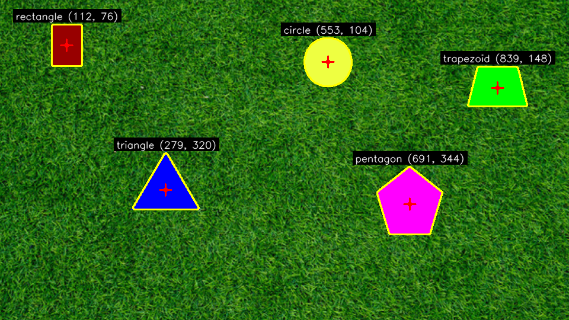
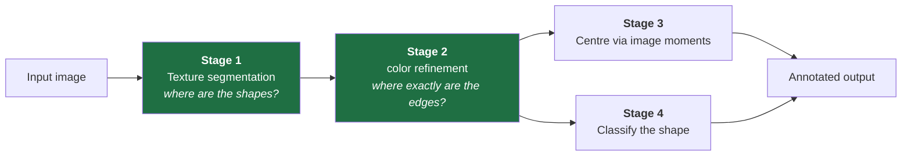

# Static Image — Shape Detection Report

**Task:** detect the shapes on the grassy background in `PennAir 2024 App Static.png`, and
locate and mark their centers.

**Code:** [`detect_shapes.py`](detect_shapes.py) · **Output:** [`output_static.png`](output_static.png)
· **Full technical write-up:** [`ALGORITHM.md`](ALGORITHM.md)

---

## Result

All five shapes detected, outlined, classified, and center-marked.

| Shape | Center (x, y) | Area (px) | Sanity check |
|---|---|---|---|
| pentagon | (691, 344) | 8791 | ~110 px across ✓ |
| trapezoid | (839, 148) | 5641 | ~90 × 65 ✓ |
| triangle | (279, 320) | 5595 | base 110, height 102 ✓ |
| circle | (553, 104) | 5122 | r = 40.4 → 81 px diameter ✓ |
| rectangle | (112, 76) | 3564 | 51 × 70 ✓ |



```
python3 detect_shapes.py            # writes output_static.png
python3 detect_shapes.py --debug    # also dumps the texture map and binary mask
```

---

## Approach

The instinctive solution — threshold out the green background in HSV — does not work on this
image, for a reason that turned out to shape the entire design. **One of the shapes is a
bright green trapezoid, the same hue as the grass.** Any threshold wide enough to erase the
lawn also erases the trapezoid.

What *does* separate figure from ground is **texture**. Grass is thousands of tiny blades, so
brightness jumps from pixel to pixel; the shapes are flat fills, so every interior pixel
matches its neighbors.

| | Grass | Green trapezoid |
|---|---|---|
| Hue | ~60° (green) | ~60° (green) |
| Local intensity std (σ) | **13.0** | **0.0** |

Hue collides completely. Texture doesn't — and it separates *all five* shapes at once,
regardless of their color. That is the discriminator the algorithm is built on.



**Stage 1 — locate by smoothness.** For every pixel, compute the local standard deviation of
intensity using the identity σ² = E[I²] − E[I]², where both expectations are box filters.
That makes it two convolutions instead of a per-pixel loop — milliseconds, not seconds.
Threshold at `0.35 × median(σ)`, then clean up with morphological close-then-open.

**Stage 2 — sharpen by color.** The texture mask locates every shape but its boundary is
imprecise (see Challenge 3). Each shape is a single uniform color, so the mask is used only
to *sample* that color, then the boundary is recovered by color distance against the original
pixels — which snaps to the true edge with sharp corners intact.

Splitting these two questions is the core design decision: Stage 1 is robust but blurry at
the edges, Stage 2 is precise but needs to be told where to look. Neither is good at both.

**Stage 3 — centers by image moments.** `cx = M10/M00`, `cy = M01/M00` gives the true area
centroid, not the bounding-box middle — which would be visibly wrong for the triangle, whose
centroid sits ⅓ of the way up from the base.

**Stage 4 — classification.** Circularity `4πA/P²` identifies the circle; a sweep of
`approxPolyDP` tolerances votes on vertex count for the polygons; a side-length comparison
separates rectangle from trapezoid.

---

## Challenges faced

### 1. The green trapezoid ruled out color thresholding

Covered above — this is why the algorithm keys on texture rather than color. Worth stating
plainly because it is the one design choice everything else follows from, and the obvious
approach fails on exactly one of the five shapes.

### 2. Otsu's method returned zero shapes

Otsu is the reflexive choice for picking a threshold automatically, and it was tried first.
It found nothing.

The reason is a useful property of Otsu: it assumes a bimodal histogram with **two
substantial classes**. Here the shapes cover about 5% of the frame, so the σ histogram is
essentially one large grass hump with a negligible spike at zero. Otsu found the best split
*within the grass distribution*, declaring half the lawn flat. The result was one contour
spanning the whole image.

**Fix:** scale the threshold to the background's own roughness instead of hunting for a
valley — `T = clip(0.35 × median(σ), 2, 20)`. On this image that is 4.6, comfortably above
the shapes' 0.0 and below the grass's 5th percentile of 7.5. Because it is relative, it
self-calibrates to different lighting or grass coarseness rather than hard-coding a level.

### 3. Morphology rounded the corners, which broke classification

Stage 1's boundary is wrong in two ways: the 11×11 variance window straddles each edge, so
the detected region is inset by ~5 px; and the 9×9 elliptical kernel files down every sharp
vertex.

The second one caused real damage. With rounded corners, `approxPolyDP` found extra vertices
and **the triangle classified as a trapezoid and the rectangle as a hexagon.** Centers were
fine; the shape names were wrong.

**Fix:** the color-refinement stage (Stage 2). The seed is used only to sample the fill color,
and the boundary is then recovered against the unblurred original, restoring sharp corners.

### 4. A single `approxPolyDP` tolerance was too brittle

`approxPolyDP` simplifies a contour to its key vertices, but everything depends on its
tolerance ε: too tight and contour noise becomes false corners, too loose and real corners
merge. The conventional `0.02 × perimeter` is a guess.

**Fix:** run 18 tolerances from 0.010 to 0.055 and take the vertex count that survives the
widest range, on the principle that a true vertex count is stable across tolerances while a
noise-induced one is not. Measured, the vote is decisive — every polygon is unanimous at
18/18, while the circle scatters across six different counts.

### 5. The circle test had a dangerously thin margin

Documenting circularity exposed a latent bug. The threshold was `circularity > 0.85`, but the
*ideal* values for a regular pentagon (0.865) and hexagon (0.907) both sit **above** it.

It only worked by luck: a rasterized contour follows pixel boundaries in stair-steps, so
`arcLength` measures a longer perimeter than the ideal shape has, pulling every measured value
below its ideal. The pentagon measured 0.786 against the circle's 0.895 — a working 0.05
margin, but one resting on rasterization noise rather than geometry. A larger, cleaner
pentagon would have classified as a circle.

**Fix:** add a second, independent signal — the ε-sweep's *consensus*. A circle has no natural
vertex count, so its approximations disagree (11/18); a polygon holds one count unanimously
(18/18). That disagreement is a structural consequence of being round, so it fails differently
than circularity does. Both tests must now fail to misclassify, and both have wide margins.

> The general lesson, and the one I'd carry into other problems: when a metric's margin is
> uncomfortably thin, look for a second signal that fails differently rather than tuning the
> first threshold harder.

### 6. Reported areas were measured on the wrong contour

A quieter bug, caught by sanity-checking the output numbers against the shapes' visible pixel
dimensions: `area` was computed on the Stage 1 seed contour *before* refinement, so every
shape was reported roughly 20% too small.

**Fix:** measure the refined contour. The corrected areas now match a by-eye measurement of
each shape (the "sanity check" column in the results table) — worth doing on any CV pipeline,
since it costs nothing and catches exactly this class of error.

---

## What made debugging tractable

Every intermediate image is written on request (`--debug`). A CV pipeline is a chain of
transformations, and reading the code rarely reveals which link broke — looking at the
pictures always does. The Otsu failure above presents in code as "returns 0 shapes," which is
nearly opaque; one look at `debug_mask.png` showed a white frame speckled with black dots and
made the diagnosis immediate.

| Symptom | Actual cause | Fix |
|---|---|---|
| 0 shapes detected | Otsu split the grass distribution | Median-relative threshold |
| Triangle called "trapezoid" | Morphology rounded the corners | Color refinement |
| Areas ~20% too small | Measured on the seed, pre-refinement | Measure the refined contour |
