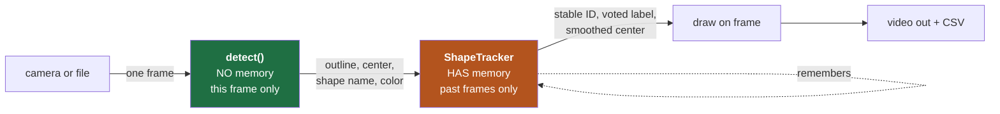
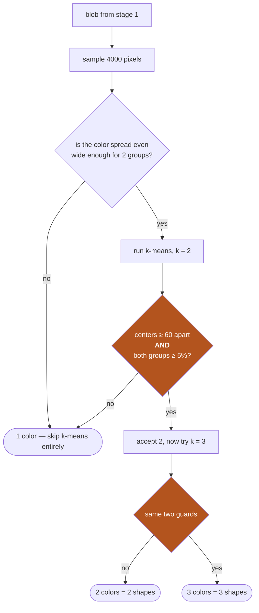
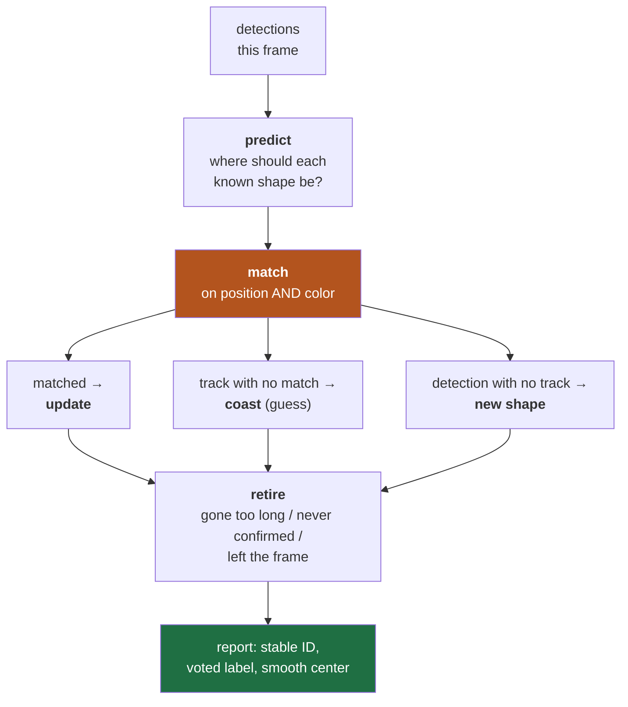

# Video Detection — the plain-English version

A review sheet for talking through [`detect_video.py`](detect_video.py) out loud.
Everything here is in [`VIDEO_DETECTION.md`](VIDEO_DETECTION.md), just said more simply.
Jargon is explained the first time it appears.

---

## 0. The 30-second version

> I already had a detector that finds shapes in a single photo. The video broke it — it went
> from finding 5 shapes to finding 3. So I split the problem in two: a **detector** that looks
> at one frame and has no memory, and a **tracker** that remembers what it saw in previous
> frames. The detector got five fixes for things video does that a photo never does — shapes
> overlap, shapes get cut off by the edge of the screen, one shape's color is nearly the same
> as the grass. The tracker uses the past to fix what a single frame can't know — mainly, it
> **votes** on what shape something is over about a second and a half of frames, which took
> classification from 87% to 99%. Then I profiled it and made it 5.7× faster so it runs faster
> than the video plays. Final numbers: 42 fps on a 30 fps video, 98% recall and precision,
> 98.8% classification accuracy.

That paragraph is the whole talk. The rest is the supporting detail.

---

## 1. The rule that shaped everything: "streaming"

The brief said treat the video like a **live feed from a drone**. I took that literally, and it
bans three things that would otherwise be really convenient:

| What I couldn't do | Why it's tempting | Why a drone can't |
|---|---|---|
| Jump to any frame | Great for debugging — skip straight to the bug | A live camera has no "frame 500" to jump to |
| Run over the video twice | Pass 1 finds shapes, pass 2 smooths the result | Pass 2 would run after the drone landed |
| Peek at future frames | Makes filling gaps trivial | The future hasn't happened yet |

**One rule: information only flows forward in time.**

In code, that means there's exactly one place a pixel enters the program:

```python
while True:
    ok, frame = cap.read()      # the ONLY place a frame enters. One at a time.
    if not ok:
        break
```

There is no `cap.set()` (the "jump to frame N" call) anywhere in the pipeline.

**The proof it's real:** `python3 detect_video.py 0` runs a live webcam through the identical
code. If I'd cheated anywhere, that wouldn't work.

*Talking point if asked:* my debugging scripts DO jump around — that's tooling, not the
pipeline. Worth admitting up front, it sounds better than being caught.

---

## 2. The big picture: two boxes



Why split it that way — this is the main design decision, so it's worth saying clearly:

- **`detect()` is "stateless"** — a fancy word meaning it has no memory. Same frame in, same
  answer out, always. That makes it easy to test (hand it one PNG), and it means one bad frame
  can't poison later frames.
- **`ShapeTracker` holds *all* the memory.** So if there's ever a bug where the program
  "cheated" and used the future, it can only be hiding in that one small class.

The payoff: when something goes wrong, the first question — *is this a detection problem or a
tracking problem?* — has a clean answer, because I can re-run the detector alone on the bad
frame.

---

## 3. What actually broke

I ran the old photo detector on video frames unchanged:

```
frame     0    n=5   pentagon, circle, rectangle, trapezoid, triangle    ✓
frame   600    n=3   pentagon, pentagon, triangle      <- 4 were visible ✗
frame  1200    n=3   hexagon, pentagon, trapezoid      <- 4 were visible ✗
```

Instead of guessing, I looked at the intermediate images. The texture map (stage 1) was
**excellent** — the shapes were clean black holes. So stage 1 was never the problem.

The mask showed the real cause immediately: a **keyhole-shaped blob** where the yellow circle
overlapped the red rectangle. Two shapes had merged into one outline, one center, one nonsense
label.

```
   circle          rectangle           what the detector saw
     ___            ______                  ___
    /   \          |      |                /   \____
   |     |    +    |      |      =        |         |
    \___/          |______|                \___     |
                                               |____|
                                            ONE blob = ONE shape ✗
```

Five problems total:

| # | Problem | Fix |
|---|---|---|
| 1 | Video is 1080p, my constants were tuned for 960 wide | §4 — scale everything |
| 2 | Shapes **overlap** and merge into one blob | §5 — split by color |
| 3 | The trapezoid is olive — too close to grass color | §6 — clean up by size |
| 4 | Shapes get **cut off** by the edge, or **hidden** behind others | §7 — detect & flag it |
| 5 | A shape gets **cut in half** by something lying across it | §8 — rejoin the pieces |

---

## 4. Fix 1 — Make it resolution-independent

Every number in the old algorithm was tuned on a 960×540 photo: an 11×11 window, a 9×9 kernel,
a 500-pixel minimum area.

**The key insight:** those numbers were never really about pixels. `11×11` meant *"about as
wide as a few blades of grass."* At 1920 wide, grass blades are twice as wide in pixels, so
`11` stopped meaning that.

There's a specific failure this risks, and it's a good one to mention because it shows you
understand *why* the number matters: if the window that measures texture is **smaller than one
blade of grass**, it can sit entirely inside a single blade, see a perfectly uniform patch, and
report *"this is flat — must be a shape."* You get false detections made of grass.

```python
def auto_params(frame_shape):
    scale = frame_shape[1] / 960.0                    # how much bigger than reference?
    odd = lambda v: max(3, int(round(v)) | 1)         # kernels must be odd-sized
    return {"win":      odd(11 * scale),
            "ksize":    odd(9 * scale),
            "min_area": int(round(500 * scale * scale))}   # AREA scales as length²
```

Three things worth knowing here:

- **`| 1` forces an odd number.** OpenCV filters need a well-defined center pixel, so an even
  size is an error. Bitwise-OR with 1 turns 18 into 19 and leaves 19 alone. Neat trick.
- **Area scales with the *square*.** Double the width and every shape has 4× the pixels.
  Scaling `min_area` linearly would be a silent bug — the filter would end up twice as strict
  as intended.
- **At 960 wide, `scale == 1.0` and every number comes out exactly as before.** The static
  image's output is byte-for-byte unchanged. That was deliberate: a refactor that quietly
  changes existing results is one you can't trust.

| Frame width | win | ksize | min_area |
|---|---|---|---|
| 960 (the photo) | 11 | 9 | 500 |
| 1920 (the video) | 23 | 19 | 2000 |

---

## 5. Fix 2 — Splitting shapes that overlap

This is the central new problem: when the circle drifts over the rectangle, both are smooth, so
the texture stage genuinely sees **one** smooth region. No amount of tuning fixes that — as far
as texture is concerned they really *are* one flat region.

**But they're different colors.** And stage 2 already samples each blob's fill color to sharpen
its outline — it just assumed there was exactly one color. Drop that assumption and the split
falls out of machinery I already had.

### What k-means is (explain this if asked)

> **k-means** sorts points into *k* groups. It picks k starting "centers," then repeats two
> steps until nothing changes: (1) assign every point to its nearest center, (2) move each
> center to the average of the points assigned to it.
>
> Here the "points" are the blob's pixels and the "space" is color (blue/green/red as x/y/z).
> So the groups it finds are literally *the distinct colors the blob is made of.*

### The hard part isn't running it — it's knowing if the split is real

k-means will happily chop a single uniform shape into two groups if you ask for two. It never
says "actually there's only one." So I measured both candidates:

| Blob (frame 600) | How far apart the 2 colors are | Group sizes | Real split? |
|---|---|---|---|
| circle + rectangle | **259.8** | 29874 / 22339 | **yes** — two real colors, both big |
| pentagon (alone) | 2.6 | 32232 / 230 | no — same color twice |
| triangle (alone) | 82.3 | 7910 / **5** | no — 2nd group is 5 pixels |

Two independent guards, and the point is that **each one catches a case the other misses:**

- **Colors must be ≥ 60 apart.** A real merge measures 260. A fake split measures 2.6. Huge
  margin, not a knife-edge threshold.
- **Every group must hold ≥ 5% of the blob.** This catches the triangle, where the colors
  *are* far apart (82) but the second "color" is just a handful of blurry edge pixels
  pretending to be a shape.

Notice: the triangle would have passed the first test. The pentagon would have passed the
second. **Neither guard alone works; together they're decisive.** That's a theme in this
project — two signals that fail in *different* ways beat one signal tuned harder.



The escape hatch at the top is for speed as much as correctness — most blobs are one shape, and
if the colors in the blob barely vary at all, you know the answer without running k-means.

---

## 6. Fix 3 — The trapezoid is nearly the same color as grass

### The problem

In the video the trapezoid is **olive**, not bright green. Measuring how far each fill color is
from grass:

| Shape | Distance from grass |
|---|---|
| circle | 264 |
| pentagon | 262 |
| rectangle | 188 |
| triangle | 181 |
| **trapezoid** | **81** ← less than half as far as anything else |

Stage 2 accepts a pixel if it's within **40** of the sampled fill color. That's comfortable
when the nearest background is 180 away. It's marginal when it's 80.

And "80" is the *median* grass pixel. **Grass isn't one color — it's a wide spread of colors,**
because every blade catches light differently. Plenty of individual grass pixels are much
closer to olive than 80, and those sneak in.

The result isn't a big wrong blob. It's a **frayed outline** — hair-like spikes and a halo of
specks. Those false bumps become false corners, so the trapezoid got classified as a
**hexagon**. It also wrecked a second measurement (solidity, §7): a completely unobstructed
trapezoid measured 0.762, which reads as "heavily hidden behind something." One bug was quietly
manufacturing a second, unrelated-looking bug.

### Why I couldn't just move the threshold

The obvious move is to tighten the 40. I tried the principled version of that — a
**nearest-centroid classifier**, which just asks "is this pixel closer to the fill color or to
the background color?" and puts the boundary exactly halfway, with no magic number at all.

| Rule | Grass leaking through |
|---|---|
| Fixed threshold of 40 | 26.5% |
| Nearest-centroid (no magic number) | 26.8% |

**No better. Slightly worse.** That's a result worth sitting with, because it tells you
something about the *problem*, not the parameter: the two color distributions genuinely
overlap. Some grass pixels really are closer to olive than to average grass. **No threshold
anywhere on that line can separate two populations that occupy the same region of space.** And
tightening it further would start deleting the shape's own edge pixels, where the fill blurs
into the background — trading a frayed outline for a chewed-up one.

So the fix has to use a **different dimension** than color.

### The leak has a different *shape*

Color can't tell a leaked grass pixel from a shape pixel. **Size can, completely.**

| | Count | Total area | Median size |
|---|---|---|---|
| The shape | 1 piece | 28,014 px | — |
| The leak | **218 pieces** | 4,280 px | **8 px** (~3 px across) |

The leak is *confetti* — 218 separate specks about 3 pixels wide, because they're individual
grass blades catching light, not real regions.

The shape is the opposite. A **distance transform** (a tool that labels every white pixel with
how far it is from the nearest black pixel) says the shape's interior reaches **69 pixels** deep.

> They overlap **completely** in color and **not at all** in size. That's the separable
> dimension.

### The tool: morphological opening

> **Opening = erode, then dilate.** **Erosion** keeps a white pixel only if the whole kernel
> centered on it is white — so it shaves a rim off everything. **Dilation** grows everything
> back by the same amount.

The magic is the **asymmetry**. Erosion isn't reversible. Anything *thinner than the kernel*
gets erased **completely** — there's no pixel left inside it for the dilation to grow back
from. The shape only loses a rim, which dilation restores.

```
                  shape (69 px deep)    fringe (1-3 px)     specks (~3 px)

raw color mask    ████████████████      ███████╲╱╲╱          ·   ·   ·
                  ████████████████      █████╱                 ·  ·

after ERODE       ░░████████████░░      ░░░░░░░░░░░          ░  ░  ░
                    └ rim lost            └ gone entirely      └ gone entirely
                      (survives)            (no pixel is deep enough)

after DILATE      ████████████████      —                    —
                    └ rim restored        └ nothing to grow from
```

The measurements match the mechanism exactly:

| Erosion kernel | Pieces left (from 219) | Shape area kept | Stray pixels (from 4280) |
|---|---|---|---|
| 3×3 | 178 | 96% | 1334 |
| 5×5 | 32 | 93% | 106 |
| **11×11** | **1** | **86%** | **0** |

At 11×11 all 218 fragments are annihilated and the shape keeps 86%, which dilation restores to
~97%.

**Then a closing** (dilate-then-erode — same trick run backwards, so it fills *gaps* smaller
than the kernel) to reseal the notches left behind.

```python
m = cv2.morphologyEx(m, cv2.MORPH_OPEN,  rk)   # kill the confetti
m = cv2.morphologyEx(m, cv2.MORPH_CLOSE, rk)   # reseal the nicks
```

**Order matters.** Opening first, while the shape is still solid. Reversed, the closing would
weld the specks onto the shape permanently before anything had a chance to remove them.

### "But didn't morphology cause the original problem?"

Good question, and worth pre-empting — stage 2 exists *because* stage 1's morphology rounded
corners and broke classification. So am I reintroducing that bug?

**No, and the reason is scale.** The kernel here is ~11 px against a shape whose perimeter is
~600 px, so corners get rounded by a few pixels. The corner-counting step (`approxPolyDP`) uses
a tolerance of 6–33 px. So:

- 5 px of corner rounding is **far below** what the classifier can even see
- a 20 px hair spike is **comfortably above** it

It removes distortion the classifier is sensitive to and adds distortion it can't detect.

| | Area | Solidity | Class |
|---|---|---|---|
| Old (close 3×3 only) | 28,964 | 0.713 | rectangle ✗ |
| **New (open + close, scaled)** | **27,170** | **0.963** | **trapezoid ✓** |

And the 6% of area given up was *measured* to be the fringe, not the shape.

> **The transferable lesson, and probably the best single line in this project:** when two
> populations overlap in the dimension you're thresholding, **stop moving the threshold and
> find a dimension where they don't.** The 26.5% vs 26.8% measurement is what proved the first
> door was closed before I spent any effort on the second.

---

## 7. Fix 4 — Knowing when a shape is hidden

Two different things make a shape only partly visible, and they need **opposite** responses.

**(a) Clipped by the edge of the frame.** The shape continues off-screen. Nothing in the image
can tell you what's out there, so the honest thing is to report what's visible and flag it:

```python
bx, by, bbw, bbh = cv2.boundingRect(c)
partial = bx <= 2 or by <= 2 or bx + bbw >= w - 2 or by + bbh >= h - 2
```

**(b) Hidden behind another shape.** Here the missing piece **is** recoverable, because every
shape in this problem is convex.

> **Convex hull** = the smallest convex outline containing all the points. Picture snapping a
> rubber band around the shape.
>
> **Solidity** = the shape's area ÷ its convex hull's area. For a convex shape, the hull *is*
> the shape, so solidity ≈ 1. Take a bite out of the side and the rubber band spans the bite
> while the actual area drops — so solidity falls.

```python
hull = cv2.convexHull(c)
solidity = area / max(cv2.contourArea(hull), 1.0)
occluded = solidity < 0.97 and not partial
```

The separation is clean, which is why 0.97 isn't a fragile threshold:

| Condition | Solidity |
|---|---|
| The 5 shapes, unobstructed | 0.985 – 0.999 |
| Rectangle with a circle over it | 0.895 |
| Triangle with a circle over it | 0.884 |
| Trapezoid behind a rectangle | 0.752 |

When a shape is bitten, its visible center gets dragged away from the hidden side. The hull
spans the bite and pulls the center back where it belongs.

**Where this stops working — and I tested it, which matters.** The hull can restore a bite out
of an *edge*. It **cannot** restore a corner that's completely covered, because that geometry
just isn't in the image. A bitten rectangle's hull still classified as "trapezoid."

So: **use the hull for the center** (strict improvement), **don't trust it for the label**.
Fixing the label needs information from outside this frame — which is exactly the tracker's job.

---

## 8. Fix 5 — Rejoining a shape cut in two

I found this one by **reading the CSV log, not by watching the video.** The log showed track IDs
9 and 11 alive at the same time, both labeled "rectangle." There's only one rectangle.

Cause: when an occluder lies *across the middle* of a shape, the visible part is two
disconnected pieces. `findContours` correctly returns two, and everything downstream reasonably
concludes there are two shapes.

```
        ┌──────────────┐              ┌────┐  ┌──────┐
        │  rectangle   │   circle     │    │  │      │   two contours,
        │      ╭───╮   │   lying   →  │    ╰──╯      │   two "shapes" ✗
        └──────╰───╯───┘   across     └──────────────┘
```

They're recognizable as one shape because they **share a seed blob AND a fill color** — by
construction they came from one region of one color. So merge them with a convex hull, guarded
by a distance check:

```python
span  = max(cv2.boundingRect(np.vstack([keep[a], keep[b]]))[2:])   # width of both together
reach = max(max(cv2.boundingRect(keep[a])[2:]),
            max(cv2.boundingRect(keep[b])[2:]))                    # width of the bigger one
if span <= 1.6 * reach:
    keep[a] = cv2.convexHull(np.vstack([keep[a], keep[b]]))
```

**The `1.6 ×` guard is the safety check:** two halves of one shape are barely further apart than
the shape is wide. Two genuinely separate same-colored shapes would be much further apart.

---

## 9. The tracker — giving the detector a memory

Everything above improves a single frame. But some information is simply **not in** a single
frame: while a shape is behind another one, the geometry that identifies it doesn't exist in the
image, and no amount of cleverness can conjure it. **A video's advantage is that the shape was
visible a moment ago.**



### 9.1 Match on color, not just position

The textbook centroid tracker matches each detection to the nearest predicted position. **It
fails in exactly the situation we care about:** when a shape gets occluded its center *lurches*,
and if the lurch is bigger than the allowed jump, the tracker gives up and starts a brand new
track — same shape, new identity.

**Position-only matching gave me 47 tracks for 5 shapes.**

But I already compute something occlusion doesn't disturb at all: **the fill color.** A
half-hidden red rectangle is still exactly as red.

```python
dcol = np.linalg.norm(t.fill - np.float32(d["color"]))
if dcol > self.color_gate:
    continue                                       # different color = different shape, skip
limit = self.gate * (2.5 if dcol < 40 else 1.0)    # ← THE KEY LINE
if dist <= limit:
    cost[i, j] = dist + self.color_weight * dcol
```

**A color match earns a 2.5× wider positional gate.** When the color agrees, a big jump is far
more likely to be occlusion than a mix-up, so let the tracker follow it. When the color
disagrees it isn't even a candidate — which also stops two shapes passing close together from
swapping IDs.

*If asked about the matching algorithm:* it's greedy — repeatedly take the cheapest remaining
pair. With 5 objects that gives the same answer as the optimal Hungarian assignment, for
microseconds and no extra dependency. `scipy.optimize.linear_sum_assignment` is the standard
tool if the object count ever grows.

### 9.2 Voting on the label — the biggest single win

Per-frame classification is right most of the time and wrong **exactly when** a shape is
occluded or clipped — which is precisely when its outline isn't its real outline.

Since identity is now stable across frames, the label can be a **vote** instead of a fresh guess:

```python
if det is not None and not det["partial"] and not det["occluded"]:
    self.votes.append(det["shape"])       # only CLEAN views get a vote
```

**The guard is the whole point.** Only frames where the entire shape is visible get to vote —
letting a clipped outline vote would be letting noise rename the shape. A track keeps about 1.5
seconds of evidence and reports the majority.

| Classification accuracy | |
|---|---|
| Per-frame, no memory | **86.6%** |
| With temporal voting | **98.8%** |

**An 11× reduction in error rate, from information that was already sitting there unused.**
That's the line to lead with if someone asks what the tracker bought.

*Small nice detail:* it's a `deque(maxlen=45)` — a fixed-size queue where appending past the
limit automatically drops the oldest item. A sliding window with zero bookkeeping.

### 9.3 Trusting the measurement the right amount

A tracked center shouldn't teleport to whatever this frame says, and shouldn't ignore it either.
How much you trust it depends on how good the look was:

```python
gain = 0.35 if (det["occluded"] or det["partial"]) else 0.8
new_center = predicted + gain * (measured - predicted)
```

A clean look moves the estimate **80%** of the way toward the measurement. A compromised one
only **35%**, leaning on the motion model instead.

> That's the core idea behind a **Kalman filter** — weigh your prediction against your
> measurement according to how reliable each one is — with the weights set by occlusion state
> instead of a full covariance calculation. For 5 smoothly-moving shapes, that's the right
> amount of machinery.

And velocity **decays while coasting**:

```python
self.center   = self.center + self.velocity
self.velocity *= 0.9                     # bleed off speed; don't drift forever
```

Without that, a track that loses its shape sails off at constant speed forever, confidently
reporting a position it has no evidence for.

### 9.4 Being born and dying

**Confirmation** — a blob must be seen 3 times before it's reported, to reject flicker. But the
validation caught the cost immediately: **5 of my 12 misses were at frame 0**, where all five
shapes are plainly visible and simply hadn't been believed yet.

The delay is there to reject noise. A large, solid, fully-visible shape is not noise:

```python
def is_strong(det, frame_area):
    return (not det["partial"] and not det["occluded"]
            and det["area"] >= 0.002 * frame_area)
```

Strong detections are confirmed on sight; marginal ones still serve the waiting period. **That
one change took recall from 96.6% → 98.0%.**

**Retirement** has three causes, and the third also came from reading the logs — coasting tracks
were drifting to x = 2322 on a 1920-wide frame. Phantoms confidently predicted off the edge of
the world.

```python
self.tracks = [t for t in self.tracks
               if t.misses <= self.max_gap                        # gone too long
               and not (t.state == "new" and t.misses > 2)        # never confirmed
               and self._in_frame(t)]                             # left the frame
```

**Out of view is out of scope.** A shape that has left the frame should stop being reported, not
be extrapolated into the void.

---

## 10. Making it real-time

First working version: **137 ms/frame = 7.3 fps** on a 30 fps source. Correct, but useless on a
drone.

**I profiled instead of guessing, and both hotspots were somewhere other than I expected.**

```
smoothness_mask      76.9 ms
refine_blob x3       64.1 ms
full detect()       137.1 ms
```

**Stage 1 (76.9 ms).** The cost wasn't the math — it was running a 19×19 morphology five times
over two million pixels. But stage 1 only has to *locate* shapes; stage 2 provides the
precision. So run it on a shrunk copy:

```python
if scale < 1.0:
    bgr = cv2.resize(bgr, None, fx=scale, fy=scale, interpolation=cv2.INTER_AREA)
```

4× fewer pixels — and it puts the frame back at the exact width every constant was tuned for.

*The subtle bit worth mentioning:* shrinking averages pixels, which reduces grass contrast. That
would normally break the threshold. It doesn't, because the threshold is **relative to the
median** — it self-calibrates. That property was chosen for robustness in the original
algorithm and paid off here in a way I didn't anticipate.

**Stage 2 (64.1 ms).** Three changes:
- k-means clusters a **4000-pixel sample** instead of all 50,000. Cluster centers don't need
  every pixel.
- A containment check that was a 101×101 dilation became a cheap overlap test. **That one change
  was worth 30 ms** — more than the entire rest of stage 2.
- Compare **squared** distances instead of real ones, dropping a square root on every pixel:

```python
d2 = ((roi.astype(np.float32) - np.float32(fill)) ** 2).sum(axis=2)
m = (d2 < tol * tol).astype(np.uint8) * 255      # d² < tol²  ≡  d < tol
```

| | Before | After | |
|---|---|---|---|
| Stage 1 | 76.9 ms | **12.6 ms** | 6.1× |
| Stage 2 | 64.1 ms | **13.1 ms** | 4.9× |
| **Full frame** | **137.1 ms** | **24.1 ms** | **5.7×** |
| Throughput | 7.3 fps | **41.5 fps** | |

**Detections are bit-identical before and after.** Nothing was traded for speed — I only removed
work that wasn't buying anything.

End to end: **mean 23.8 ms, p95 29.6 ms, max 39.4 ms.**

> **Say this if you can:** for a live feed the **p95 matters more than the mean.** A pipeline
> that averages 30 fps but stalls for 200 ms every second drops frames. Here the *worst* frame
> out of 1837 still cleared the 33 ms deadline.

---

## 11. How I know it works

"It looks right in the video" isn't a measurement, and eyeballing 6 frames out of 1837 proves
very little. But there was no ground truth to check against.

**The way out: build an independent oracle.** A second detector that solves the same problem by
a completely different route, using information the real algorithm never gets. The five fill
colors are known, so you can count shapes by color matching alone.

This oracle would be **useless as a detector** — it only works because someone told it the
answers, and it's exactly the color-thresholding approach the main algorithm rejected. **That's
precisely what makes it a fair check:** it shares no parameters, no assumptions, and no failure
modes with the texture pipeline. When two unrelated methods agree, the agreement means something.

Over 74 sampled frames (348 shape-instances):

| Metric | Value |
|---|---|
| True positives | 341 |
| False negatives | 7 |
| False positives | 7 |
| **Recall** | **0.980** |
| **Precision** | **0.980** |
| **F1** | **0.980** |

**The failures were as informative as the score.** Listing each miss with its size and position
showed 5 of the original 12 were at frame 0, and 4 were shapes clipped at the border while
entering — which is what motivated the strong-detection rule in §9.4. *The validation didn't
just grade the pipeline, it found the next bug.*

**A second, structural check:** where do tracks begin and end? If identity were fragmenting,
tracks would start and stop in the middle of the frame. Instead — the video is a continuous pan,
so shapes genuinely enter and leave constantly:

| Track births | | Track deaths | |
|---|---|---|---|
| at t = 0 | 5 | at frame edge | 22 |
| at frame edge | 22 | at video end | 5 |
| mid-frame | **2** | mid-frame | **2** |

**27 of 29 births and deaths happen exactly where they should.**

---

## 12. The numbers to have ready

| | |
|---|---|
| Source | 1920×1080, 30.3 fps, 1837 frames, 60.6 s |
| Latency | mean 23.8 ms · p95 29.6 ms · max 39.4 ms |
| **Throughput** | **42.0 fps** vs 30.3 fps source — ~28% headroom |
| **Recall / Precision** | **0.980 / 0.980** |
| **Classification accuracy** | **0.988** (86.6% without voting) |
| Speedup from optimization | **5.7×**, bit-identical output |
| Distinct tracks | 29 (27 born/died at the frame edge) |
| All 5 shapes present | 1451 of 1837 frames |

One nice honesty detail worth mentioning: when a shape is being *coasted* (guessed) rather than
actually measured, it's drawn with a **dashed** marker labeled `[predicted]`. **The overlay
never presents an inference as an observation.**

---

## 13. Limits — say these before you're asked

Being upfront about limits reads as confidence, not weakness.

- **Occluded classification needs a clean look first.** A shape that enters the frame already
  behind another one has no clean votes and falls back to its raw per-frame label. That's
  correct behavior — it reports what it can actually see — but it's a real limit.
- **Color is doing identity work.** Two shapes of the *same* color passing through each other
  could swap IDs. The fix is a richer appearance descriptor than a mean color.
- **The motion model is constant-velocity.** A sharp turn during a long occlusion gets
  mispredicted. A full Kalman filter with acceleration would handle it.
- **Occlusion tolerance caps at ~0.7 s** (20 frames). Longer and the track retires and comes back
  with a new ID.
- **Convex-hull recovery assumes convex shapes.** True for all five here, and stated in the
  code. A crescent or an L-shape would be systematically over-estimated.
- **No camera-motion compensation.** The whole scene pans, so velocities are image-space, not
  world-space.

**And the natural next step:** for actual drone use the priority isn't better detection — it's
**projecting centers into world coordinates**, which needs camera intrinsics and pose. The pixel
center this produces is the *input* to that, not the end of it.

---

## 14. Vocabulary cheat sheet

| Term | Plain English |
|---|---|
| **Stateless** | Has no memory. Same input always gives the same output. |
| **Causal** | Only uses the past, never the future. |
| **Contour** | The outline of a region, stored as a list of points. |
| **Centroid** | The average position of all a shape's pixels — its "center of mass." |
| **Kernel** | The little window a filter slides over the image. Must be odd-sized so it has a center. |
| **Erosion** | Shave a rim off every white region. Thin things vanish entirely. |
| **Dilation** | Grow every white region by a rim. |
| **Opening** | Erode then dilate = delete anything thinner than the kernel. |
| **Closing** | Dilate then erode = fill any gap smaller than the kernel. |
| **k-means** | Sorts points into k groups by repeatedly assigning to nearest center and re-averaging. |
| **Convex hull** | Rubber band snapped around the shape. |
| **Solidity** | area ÷ convex hull area. Near 1 = nothing's covering it. |
| **Distance transform** | Labels each white pixel with how far it is from the nearest black pixel. |
| **Gate** | The maximum jump allowed before the tracker refuses to call it the same object. |
| **Coasting** | A track with no detection this frame, moving on its predicted velocity. |
| **Kalman filter** | Blends prediction and measurement, weighted by how much you trust each. |
| **Recall** | Of the shapes that were there, what fraction did I find? |
| **Precision** | Of the things I reported, what fraction were real? |
| **p95** | The worst 5% cutoff. 95 out of 100 frames were faster than this. |
| **fourcc** | The 4-character video codec code a `VideoWriter` needs. |

---

## 15. The three things to make sure you say

1. **The architecture split.** Stateless detector + causal tracker. It's the design decision
   everything else hangs off, and it's why debugging had a clean question to ask.
2. **The transferable lesson from the trapezoid.** When two populations overlap in the dimension
   you're thresholding, stop moving the threshold and find a dimension where they don't. And I
   *measured* (26.5% vs 26.8%) that the first door was closed before spending effort on the
   second.
3. **Temporal voting: 86.6% → 98.8%.** The biggest win in the project came from information that
   was already there and simply wasn't being used.

And if there's room for a fourth: **the validation found bugs.** The frame-0 confirmation miss
and the phantom track at x = 2322 both came out of the logs, not out of watching the video.
