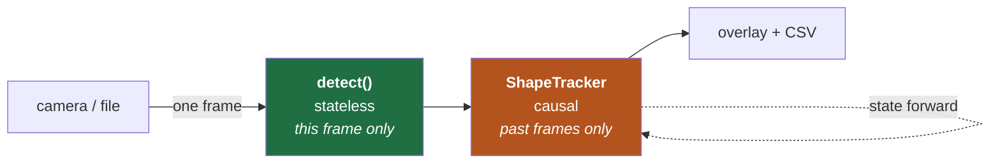

# Video — Performance Report

**Task:** apply the shape-detection algorithm to `PennAir 2024 App Dynamic.mp4`, treating the
video as a streamed input — one frame at a time, as a drone would process a live feed.

**Code:** [`detect_video.py`](detect_video.py) · **Output:** [`output_dynamic.mp4`](output_dynamic.mp4),
[`track_log.csv`](track_log.csv) · **Full technical write-up:** [`VIDEO_DETECTION.md`](VIDEO_DETECTION.md)

---

## Headline results

Source: 1920×1080, 30.3 fps, 1837 frames, 60.6 s.

| | |
|---|---|
| **Throughput** | **42.0 fps** vs. 30.3 fps source — real-time with ~28% headroom |
| Per-frame latency | mean 23.8 ms · median 23.3 ms · **p95 29.6 ms** · max 39.4 ms |
| **Detection recall / precision** | **0.980 / 0.980** (F1 0.980) |
| **Classification accuracy** | **0.988** |
| Shapes tracked per frame | mean 4.80 (all 5 present in 1451 of 1837 frames) |
| Distinct tracks | 29, of which 27 begin and end at the frame edge |
| Track label purity | mean 0.973; 17 of 29 tracks hold one label for their entire life |

For a live feed the **p95 matters more than the mean** — a pipeline averaging 30 fps but
stalling 200 ms once a second drops frames. Here the single worst frame out of 1837 (39.4 ms)
still cleared the 33 ms deadline.

```
python3 detect_video.py                    # writes output_dynamic.mp4 + track_log.csv
python3 detect_video.py --no-video         # throughput measurement only
python3 detect_video.py 0                  # live webcam, unchanged code path
```

---

## Streaming design

The constraint was taken literally. Frames enter at exactly one place:

```python
while True:
    ok, frame = cap.read()          # the only place a frame enters. One at a time.
```

There is no `cap.set()` anywhere in the pipeline, no second pass, and no access to future
frames. Each frame is read, processed, drawn, written, and dropped; the only thing that
persists is a few hundred bytes of tracker state per shape. Pointing it at a camera index
instead of a file runs the identical code path, which is the real test of whether the
constraint was respected.



`detect()` is a pure function of one frame — the same function the static script calls — so a
bad frame cannot corrupt later frames, and any failure can be reproduced by handing it that
one frame. All state lives in the tracker, which keeps the only place a causality bug could
hide small enough to audit.

---

## How the algorithm performed out of the box

Poorly, and informatively. Run unchanged, it found all 5 shapes in frame 0 and then dropped
to 3 for most of the video.

The diagnosis was not what I expected. The texture map and seed mask were **excellent** at
1080p — the shapes were clean black holes in a field of grass texture, so Stage 1 was working
fine. The mask showed the real problem directly: a **keyhole-shaped blob** where the yellow
circle overlapped the red rectangle. Two shapes, one connected region, one center, one
nonsense classification.

Video introduces four conditions a single photo never had:

| Problem | Why it breaks a per-frame detector |
|---|---|
| **Occlusion** — shapes overlap | Both are smooth, so texture sees one region. No Stage 1 tuning can separate them |
| **Clipping** — shapes cross the frame edge | The outline describes the visible piece, so the vertex count is wrong by construction |
| **Resolution** — 1080p, not 960×540 | Every window was tuned to "a few grass blades wide" and no longer is |
| **A closer fill color** — the trapezoid is now olive | It sits 80.8 from grass where the others sit 180–264 |

---

## Adjustments for accuracy

**Splitting overlapping shapes.** A merged blob contains two distinct uniform fill colors, so
k-means in BGR space separates them. The hard part is deciding whether a split is *real* —
k-means will happily divide one uniform shape if asked. Two independent guards settle it:

| Blob | Separation | Cluster sizes | Split? |
|---|---|---|---|
| circle + rectangle (merged) | **259.8** | 29874 / 22339 | yes |
| pentagon (single) | 2.6 | 32232 / 230 | no — same color twice |
| triangle (single) | 82.3 | 7910 / **5** | no — second cluster is 5 px |

Neither guard alone is sufficient: the triangle passes the separation test, the pentagon
passes the size test. Requiring separation ≥ 60 **and** every cluster ≥ 5% of the blob is
decisive on all three.

**Detecting occlusion.** Solidity (area ÷ convex-hull area) is ≈1 for these shapes, which are
all convex, and drops when something bites into the outline. Clean shapes measure 0.985–0.999;
occluded ones 0.752–0.895 — a clean separation at 0.97. When occluded, the convex hull spans
the bite and restores the centroid. It cannot restore a *fully covered corner*, so the hull is
trusted for the center and not for the label.

**A fill color too close to the grass.** The olive trapezoid let scattered grass pixels pass
the color test, fraying its outline into false vertices — it classified as a hexagon, and the
fray also corrupted its solidity (0.762 while completely unobstructed, i.e. one defect
manufacturing a second). A *tighter* threshold was tried and rejected: nearest-centroid
classification leaked 26.8% versus 26.5% for the fixed threshold, no better. The leak is
speckle, and speckle is a job for morphology — an opening fixed it (solidity 0.713 → 0.963),
costing 6% of area that was fringe rather than shape.

**Rejoining bisected shapes.** An occluder lying across the middle of a shape splits its
visible area in two, which reads as two shapes. Fragments sharing a seed blob *and* a fill
color are rejoined, guarded by a proximity test so two genuinely separate same-color shapes
aren't merged.

**Temporal label voting — the single largest win.** Per-frame classification fails exactly
when a shape is occluded or clipped, because then its outline isn't its real outline. Since
the tracker holds identity across frames, the label becomes a majority vote over ~1.5 s,
counting **only frames where the whole shape is visible**:

| Classification accuracy | |
|---|---|
| Per-frame, no temporal help | **86.6%** |
| After temporal voting | **98.8%** |

An 11× reduction in error rate, from information already present and simply unused.

**Matching on color, not just position.** A textbook centroid tracker matches to the nearest
predicted position — which fails precisely when it matters, because an occluded shape's
centroid lurches, and a lurch past the gate makes the tracker drop the shape and re-acquire it
as a new identity. Position-only matching produced **47 tracks for 5 shapes.** Fill color is
untouched by occlusion (a half-hidden red rectangle is exactly as red), so matching uses both,
and a color match earns a 2.5× wider positional gate. Fragmentation fell to **29 tracks**, of
which 27 begin and end at the frame edge — legitimate, since the video is a continuous pan.

---

## Adjustments for computational cost

The first working version was correct but ran at **137 ms/frame — 7.3 fps** on a 30 fps
source. Rather than guess at optimizations, I profiled:

```
smoothness_mask      76.9 ms
refine_blob x3       64.1 ms
full detect()       137.1 ms
```

Both hotspots were somewhere other than where I'd have guessed.

**1. Run Stage 1 downscaled (76.9 → 12.6 ms).** The cost was *not* the variance computation —
box filters are O(1) per pixel regardless of window size. It was a 19×19 elliptical morphology
applied five times over two million pixels. But Stage 1 only has to *locate* shapes; Stage 2
supplies the precision. So it runs on a copy downscaled to 960 wide: four times fewer pixels,
and it puts the frame back at the exact width every constant was tuned for.

Downsampling averages pixels and so reduces grass contrast — which is harmless *only* because
the threshold is relative to the median and self-calibrates. That property was chosen for
robustness in the static algorithm and paid off here in an unanticipated way.

**2. Replace a 101×101 dilation with an overlap test (worth ~30 ms).** Refinement bounded
itself by dilating the seed to define which pixels it could claim. Correct, but a kernel that
size cost more than the entire rest of Stage 2. The same guarantee comes from testing the few
candidate contours for overlap against the seed with `bitwise_and` — the single largest saving
in the pipeline.

**3. Cluster a sample, not every pixel.** k-means was running over ~50000 pixels per blob;
cluster centers converge just as well on a 4000-pixel sample. Additionally, most blobs are a
single shape, so if the color spread is far too narrow to hold two clusters `min_sep` apart,
the answer is returned without running k-means at all.

**4. Compare squared distances.** `d² < tol²` is equivalent to `d < tol` for non-negative
values, dropping a square root over every pixel of every ROI — free whenever distances are
only compared, never reported.

| | Before | After | Speedup |
|---|---|---|---|
| Stage 1 (texture segmentation) | 76.9 ms | **12.6 ms** | 6.1× |
| Stage 2 (color refinement) | 64.1 ms | **13.1 ms** | 4.9× |
| **Full frame** | **137.1 ms** | **24.1 ms** | **5.7×** |
| **Throughput** | 7.3 fps | **41.5 fps** | |

**Detections are bit-identical before and after.** None of this traded accuracy for speed — it
removed work that wasn't buying anything, which is the only kind of optimization worth making
before the algorithm is settled.

Two further tuning knobs exist for tighter compute budgets: `--scale` processes the whole
pipeline at reduced resolution, and `work_width` controls Stage 1's working resolution
independently.

---

## Validation method

"It looks right in the video" is not a measurement, and inspecting six frames out of 1837
proves little. With no ground truth available, I built an **independent oracle**: a second
detector that counts shapes by matching the five known fill colors, using
`connectedComponentsWithStats`.

That oracle is useless as a detector — it works only because it was told the answers, and it
is exactly the color-thresholding approach the static algorithm rejected. That is what makes
it a *fair* check: it shares no parameters, assumptions, or failure modes with the texture
pipeline, so agreement between them is informative.

Over 74 sampled frames (348 shape-instances): **341 true positives, 7 false negatives, 7 false
positives — recall 0.980, precision 0.980.**

The failures were as useful as the score. Listing every miss with its size and position showed
that 5 of the original 12 occurred at **frame 0**, where all five shapes are plainly visible
and had simply not yet satisfied the tracker's 3-frame confirmation delay. That delay exists to
reject flicker — but a large, solid, fully-visible shape is not flicker, so strong detections
are now confirmed on sight. Recall went from 0.966 to 0.980. **The validation didn't just score
the pipeline; it found the next bug.**

A second, structural check: if identity were fragmenting, tracks would start and stop in
mid-frame. Instead 27 of 29 births and deaths occur at the frame edge, consistent with a
continuous pan.

---

## Known limits

- **Occluded classification depends on a prior clean view.** A shape entering the frame already
  behind another has no clean votes and falls back to its raw per-frame label — correct
  behaviour, but a real limit.
- **Color carries identity.** Two same-colored shapes passing through each other could swap
  IDs. Size and shape-class in the match cost, or a proper appearance descriptor, would help.
- **Constant-velocity motion model.** A sharp direction change during a long occlusion will be
  mispredicted; a Kalman filter with acceleration would track it better.
- **Occlusion tolerance caps at ~0.7 s** (`max_gap = 20` frames), after which a track retires
  and returns with a new ID.
- **Convex-hull recovery assumes convex shapes** — true for all five here, and stated in the
  code, but a crescent or L-shape would be over-estimated.
- **No ego-motion compensation.** The whole scene pans, so velocities are image-space. For
  drone use, subtracting camera motion would separate "the shape moved" from "the camera
  moved."

The natural next step for real drone use isn't better detection — it's **projecting centers
into world coordinates**, which requires camera intrinsics and pose. The pixel center this
produces is the input to that, not the end of it.
